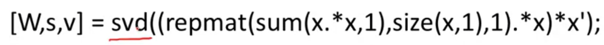
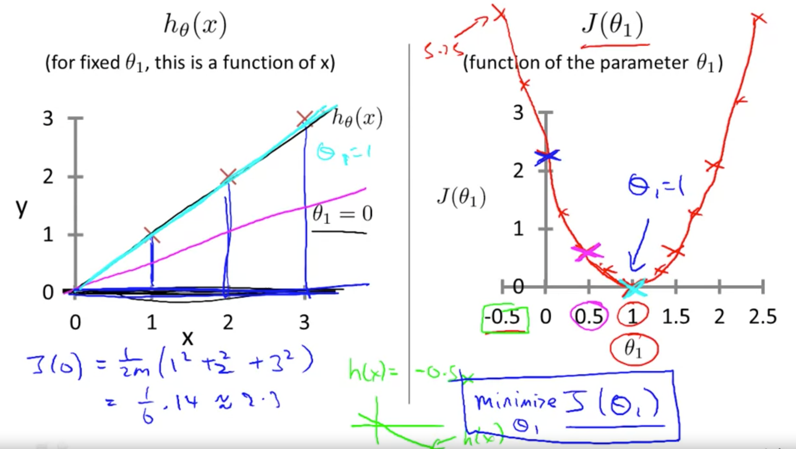
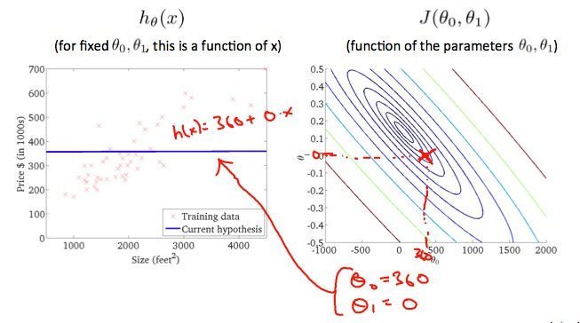
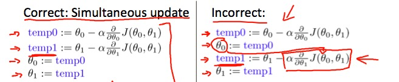
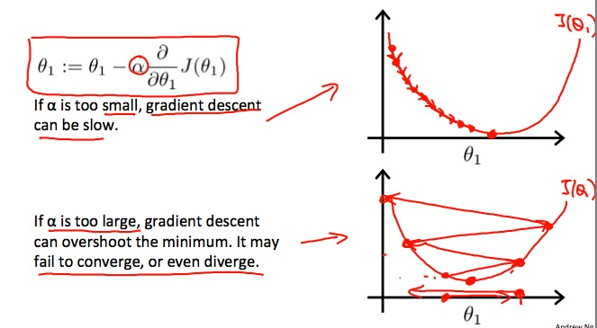
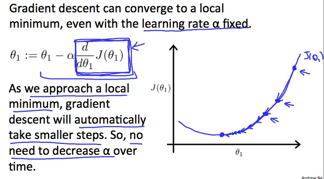
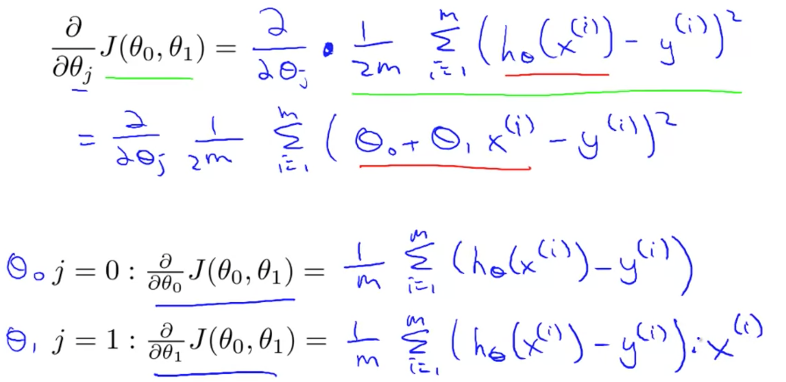
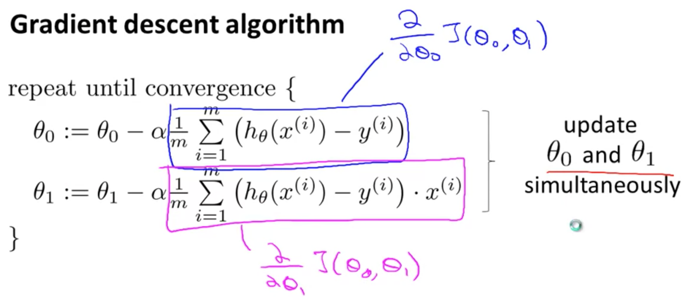

# Introduction
Machine Learning（我在之后简称为ML）
* 诞生于 AI，因为我们使用基础的编程无法让 AI 独立完成任务，所以需要借助 ML 让机器自己学习
* 应用
    * Data mining 
    * Applications can't program by hand 如自动驾驶、手写识别、NLP、CV...
    * Self-customizing programs 如推荐系统、搜索 ranking
    * Understanding human learning (brain - real AI)
* 定义
    * ML
    * Supervised Learning
    * Regression Problem
    * Classification Problem
    * Unsupervised Learning - 聚类
* 思考
    1. 如何处理无限多的特性呢？你如何存储无限数量的东西？你的电脑什么时候会内存不足？-> 支持向量机[red]
    2. Cocktail Party Problem 
        * 鸡尾酒会声音混杂->分离
        
    3. Octave 这个软件现在怎么样呢？[red]

# Model Representation
* 定义
    * Training set
    * m = # of training examples
    * x = input
    * y = label / target
    * (x, y) = one training example
    * (x^i, y^i) = i_th training example
* 流程图
    * Training set -> Learning Algorithm -> h （其中 h 代表 hypothesis，吴恩达认为这个表述不是很恰当，但按照惯例就这么叫了，可以理解成对输入输出映射函数的一种猜测）
    * input -> h -> output
* how do we represent h?
    * Linear regression with one variable
    * Univariate linear regression

# Cost Function

Q: 为什么这里 /2m，而不是 /m？原视频里说使得数学计算更简化？[red]
A：This function is otherwise called the **Squared error function**, or **Mean squared error**. The mean is halved $\left(\frac{1}{2}\right)$ as a convenience for the computation of the **gradient descent**, as the derivative term of the square function will cancel out the $\frac{1}{2}$ term. [red]

下图中，我们简化了优化的方程，将两个参数 $\theta$ 变成了一个参数（固定 $\theta_0=0$），即保留系数，去掉截距。请注意：
1.$h_{\theta}(x)$ 是在确定了 $\theta_1$，关于 $x$ 的函数；[red]
2.$J(\theta_1)$ 是关于 $\theta_1$ 的函数 [red]

上图讨论的是简化条件下一维的情况，下面讲讲二维怎么做。
提到了 Contour plots/figures 也就是轮廓图：

# Gradient Descent
应用广泛的技术！

算法内容:

注意:我们提到的梯度下降，都是指**同步**的梯度下降！[red]

原话的翻译：
> 同步更新是梯度下降常用的一种算法，实际上也是更自然的实现方法，当人们谈到梯度下降的时候指的就是同步更新。采用非同步更新时代码也许可以正常运作，但并不是人们所指的梯度下降算法。

根据 [为什么梯度下降需要同步更新参数？ - 知乎](https://www.zhihu.com/question/29615428)：
> 梯度下降就是从一个点开始，往梯度最大的方向移动。
> 二维情况下，只有两个维度同时移动，才是往梯度最大方向移动。而错误的方法中，两次移动都不是往梯度最大方向。
> 比如，你站在原点，J对x、对y梯度都是-1，显然该向+45度方向移动。而错误的方法是先向x方向移动，再从新计算梯度，然后向y方向移动

如果学习率 $\alpha$ 设置的不好：

除了上述两种极端之外，还有可能达到局部极值点：

那么我们该如何将 gradient descent algorithm 和 linear regression model 相结合呢？

最后，我们总结一下算法流程：

线性回归求解一般为 Convex function 凸函数，也就是 Bowl-shaped，不存在局部最优解，只有一个全局最优！所以还是比较好解决的！（单元检测错了道题，就是说线性回归问题可能会陷入局部最优，这是错误的❌）[red]

**“Batch” Gradient Descent** 其中 “Batch” 的意思是 Each step of gradient descent uses all the training examples，即每一次计算，求和的是全部数据集。

注意：梯度下降只是线性规划求解的一种方法，还可以通过其它方法，比如 normal equations method，但是梯度下降算法在大数据领域效果更好！[red]

# Linear Algebra
通过了测试，就没学习视频了。W

