# gradient descent with large datasets

不小心选错了一次：

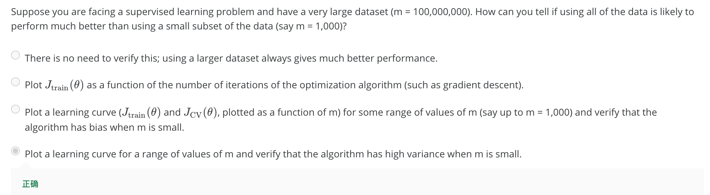
- - - - - 

左图，可以新增一些dataset来提高performance；右图，多加一些特征、神经网络加一些隐藏的单元，在增加dataset也无法提升。
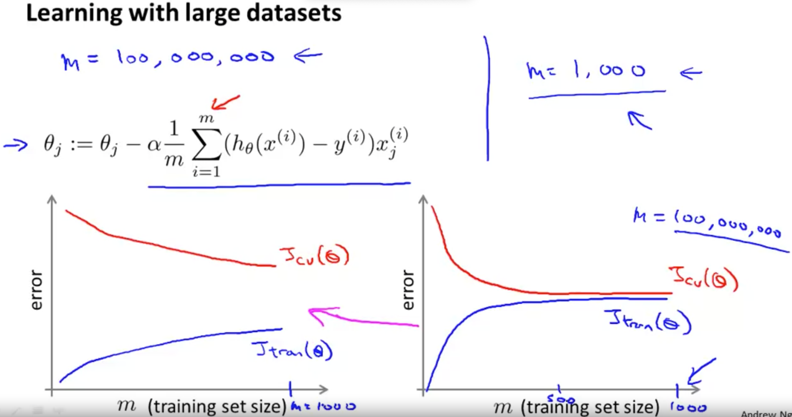

## Stochastic Gradient Descent

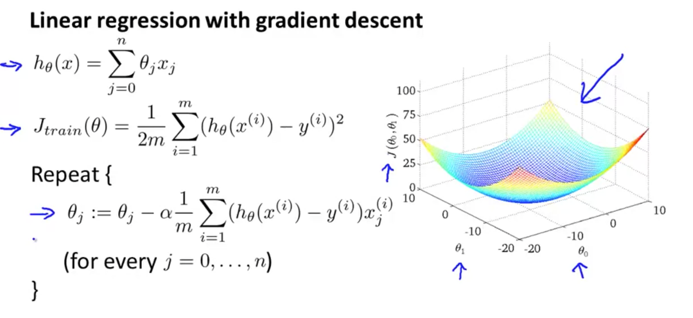
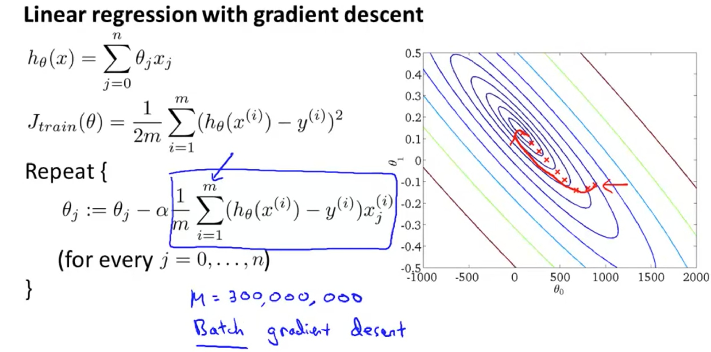

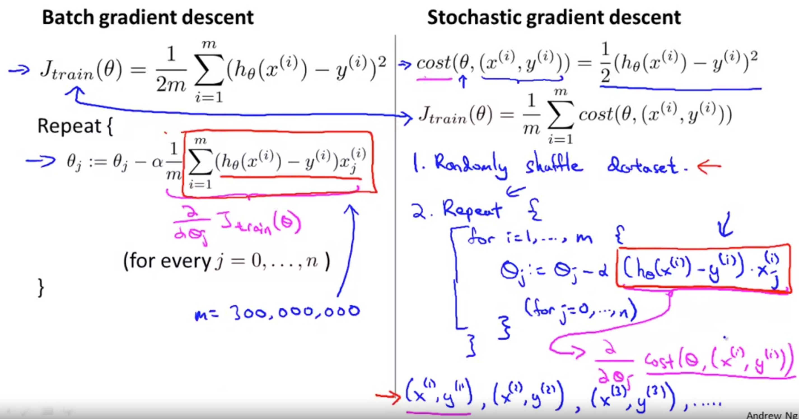
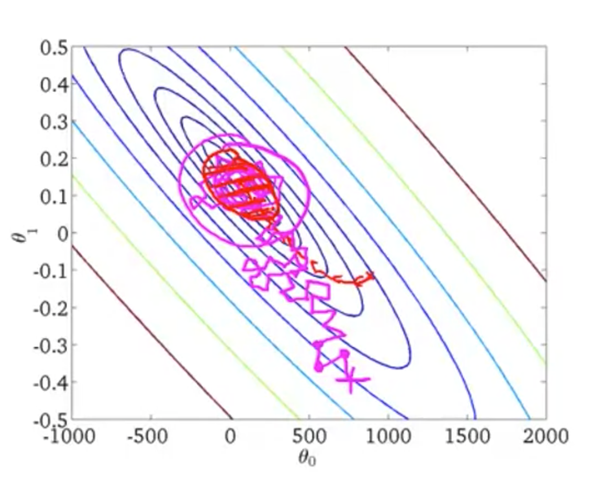

## Mini-Batch Gradient Descent

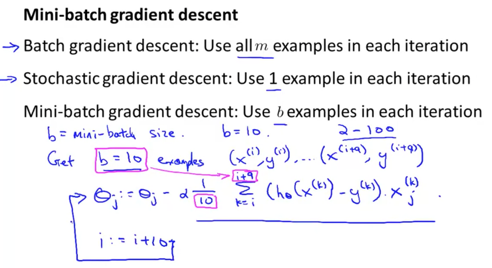

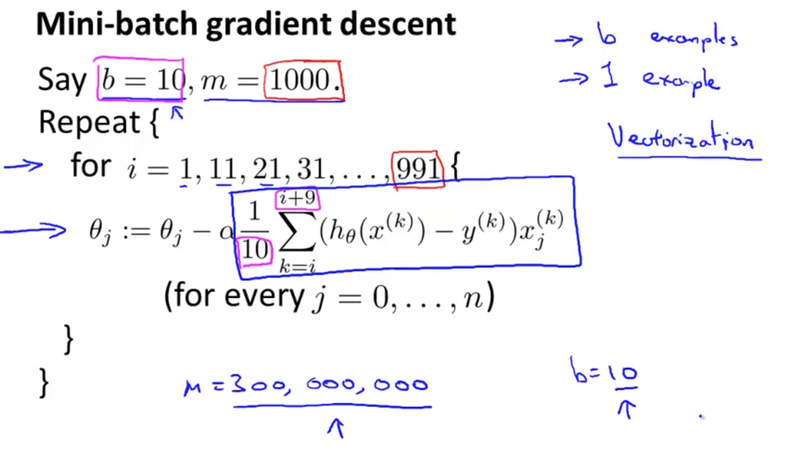

## Stochastic Gradient Descent Convergence

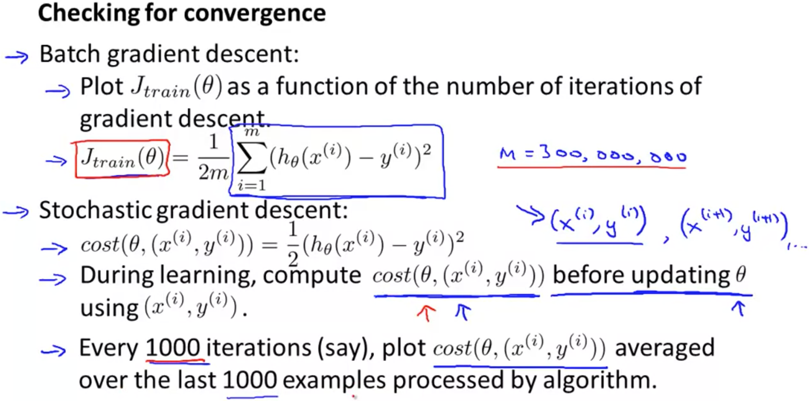

1.红线减小学习率 2.红线增加examples 3.还是增加examples 4.发散了
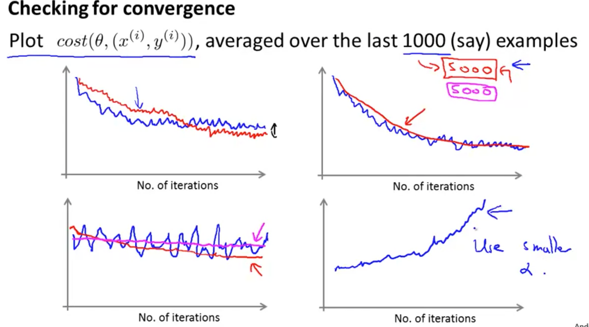

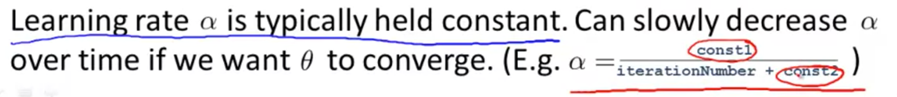

但很多人不愿意用这个办法的原因是 你最后会把问题落实到 把时间花在确定常数1和常数2上 这让算法显得更繁琐 也就是说 为了让算法更好 你要调整更多的参数 但如果你能调整得到比较好的参数的话 你会得到的图形是 你的算法会在最小值附近振荡 但当它越来越靠近最小值的时候 由于你减小了学习速率 因此这个振荡也会越来越小 直到落到几乎靠近全局最小的地方

# Advanced Topics

## Online Learning

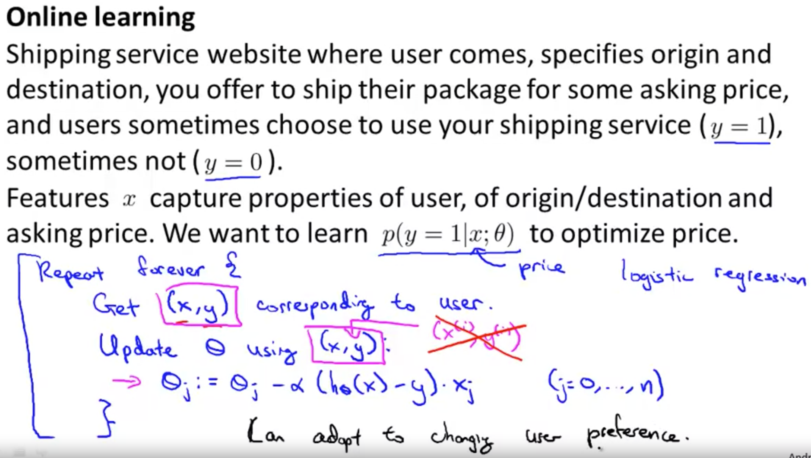

CTR：Click Through Rate
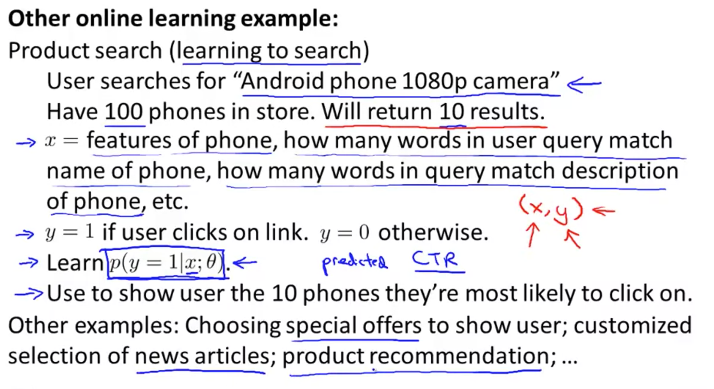

## Map Reduce and Data Parallelism
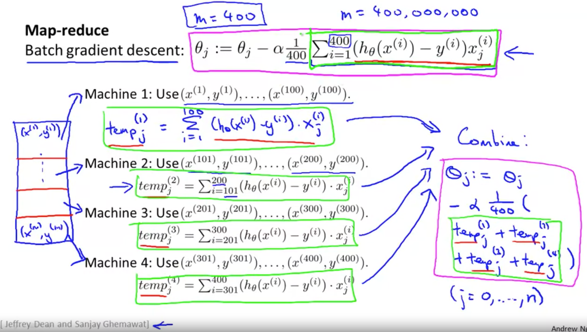
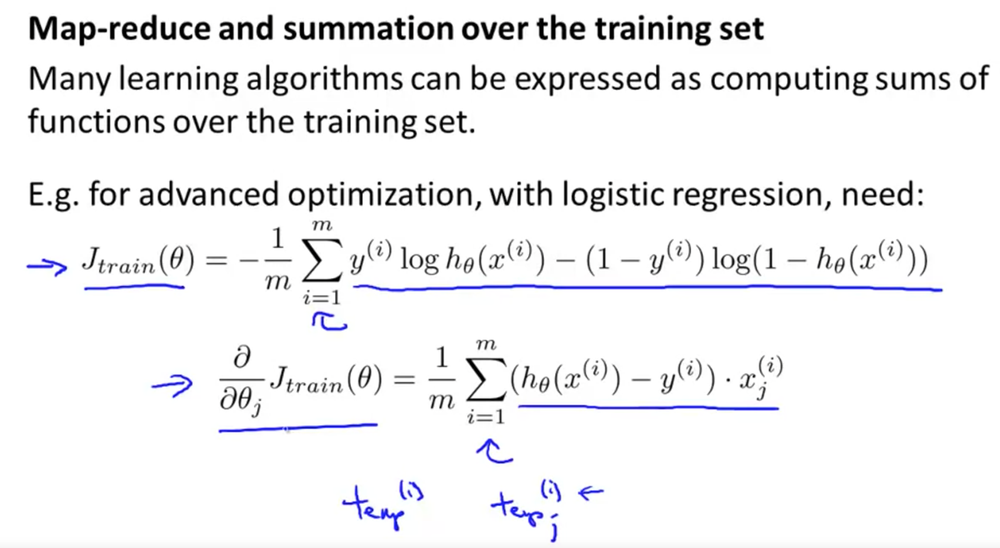

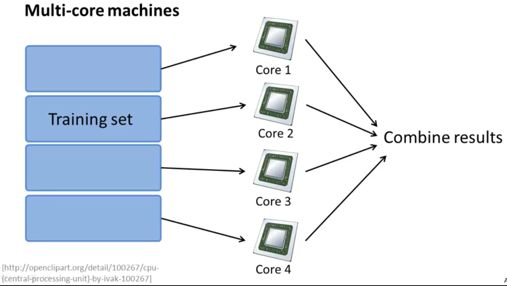

那么请注意 某些线性代数函数库会自动利用多个核 并行地完成线性代数运算 因此 如果你幸运地 使用了这种 线性代数函数库 当然 并不是每个函数库都会自动并行 但如果你用了这样一个函数库 并且你有一个矢量化得很好的算法实现 那么 有时你只需要 按照标准的矢量化方式 实现机器学习算法 而不用管多核并行的问题

开源项目：hadoop

