# Photo OCR

## Problem Description and Pipeline

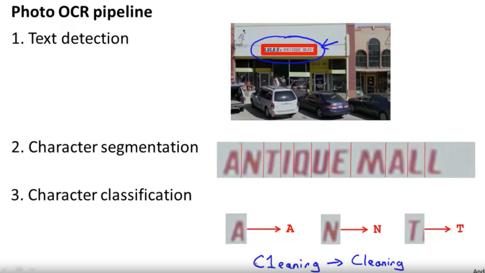

## Sliding Windows

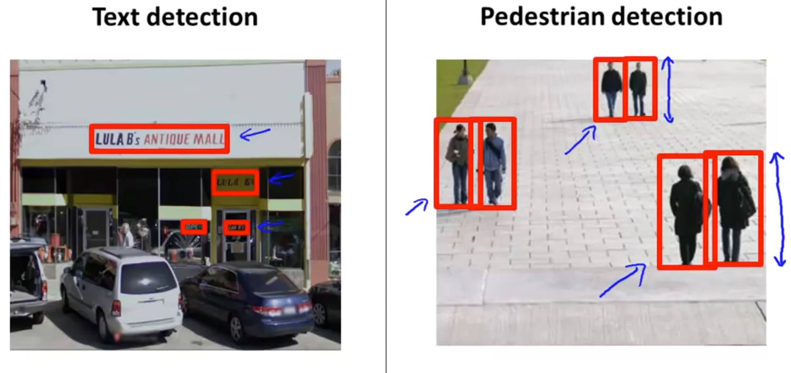
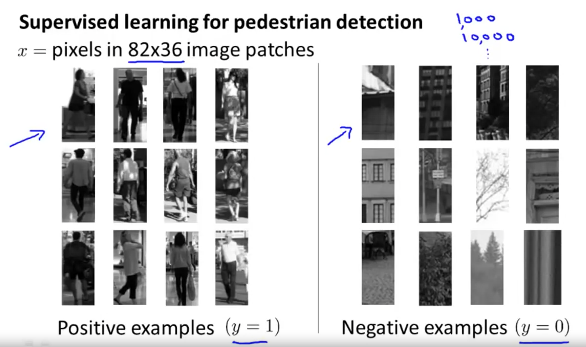
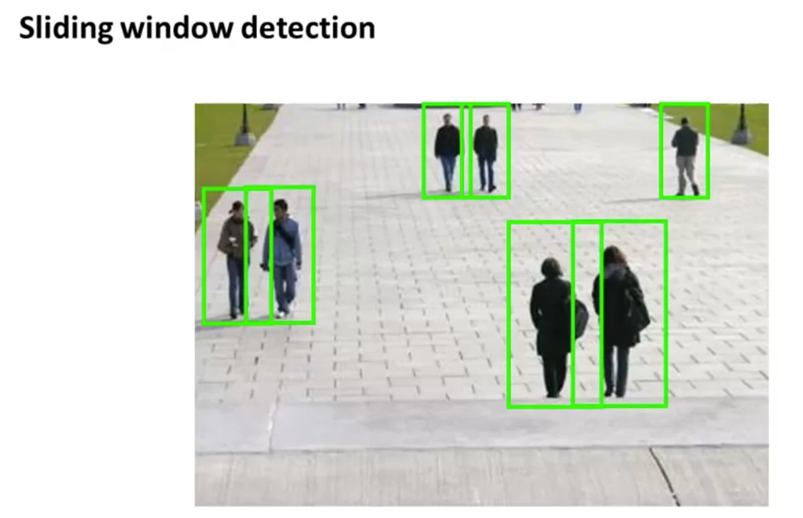
这里 expansion 的意思是把断断续续的粘在一起，合并成条子状态。
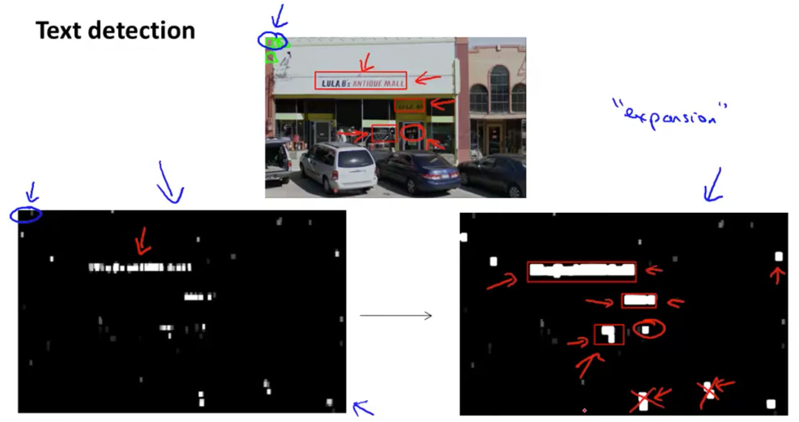
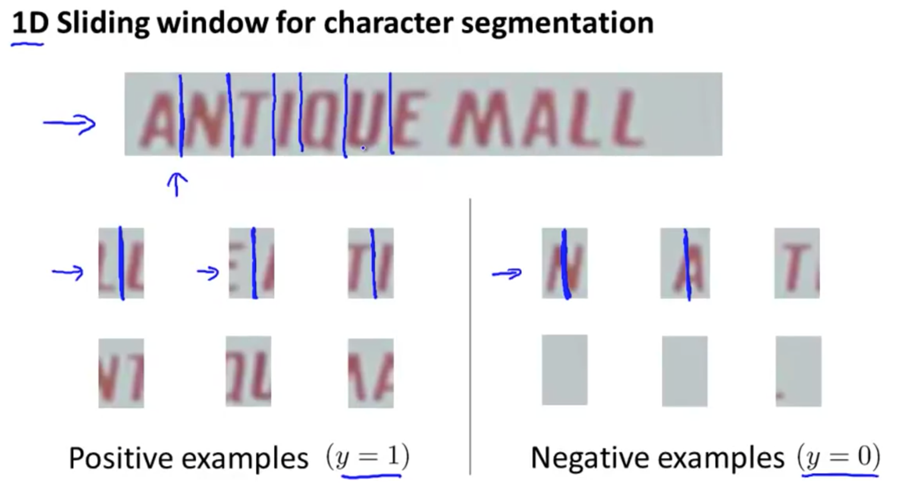

## Getting Lots of Data and Artificial Data

这里的数据合成是说从网上下载 free fonts,随机添加一个背景合成了新的数据集。
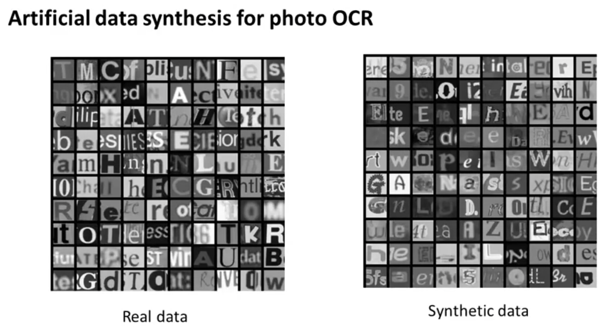

- - - - - 

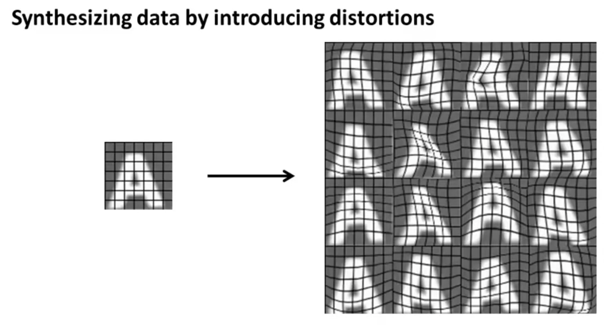
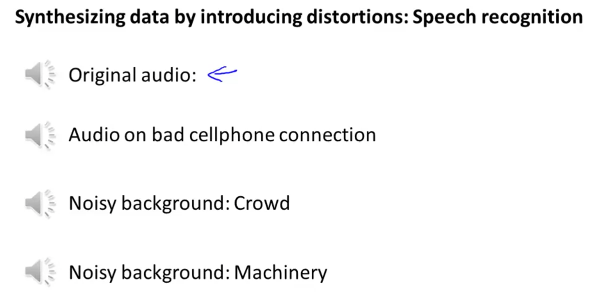
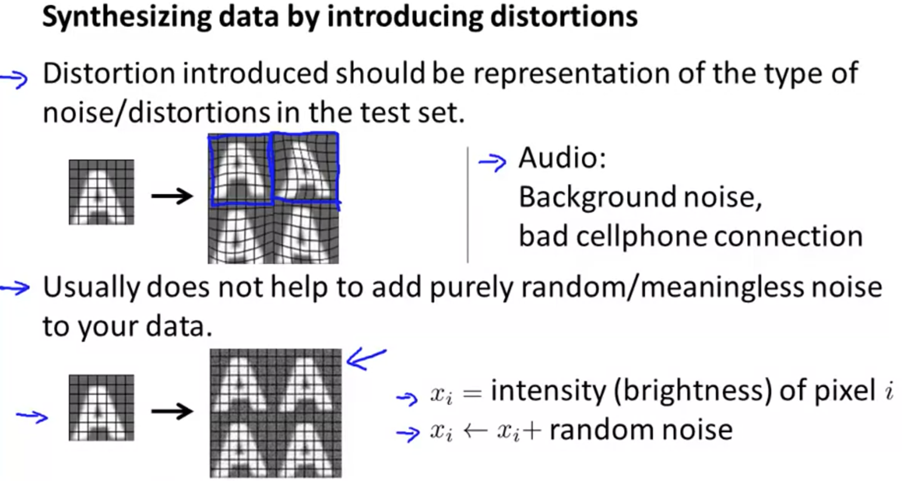

- - - - - 

本来这题我选c，居然错了！！

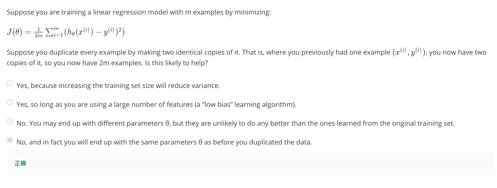

~~我对正确答案存疑！~~ 正确答案也不是不能理解，只是我总觉得尽管给定一样的顺序，训练的随机性应该会对结果造成一些扰动吧？

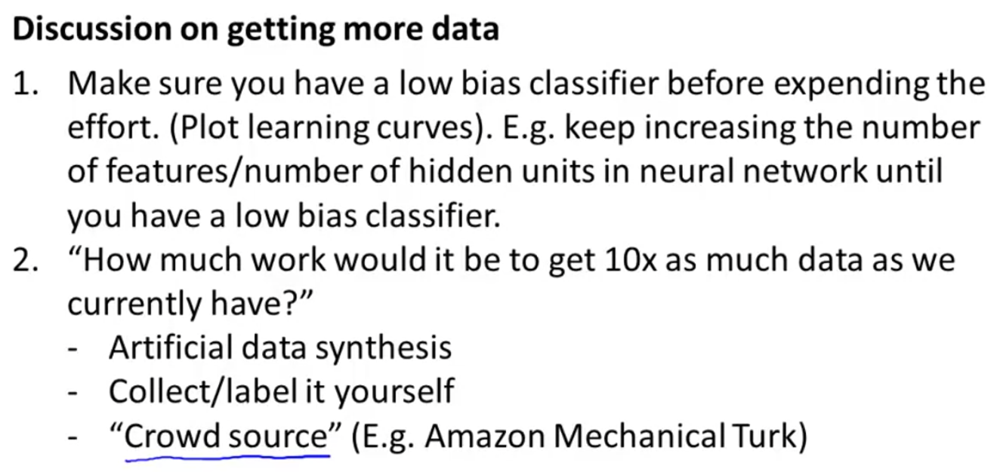

## Ceiling Analysis: What Part of the Pipeline to Work on Next

上限分析

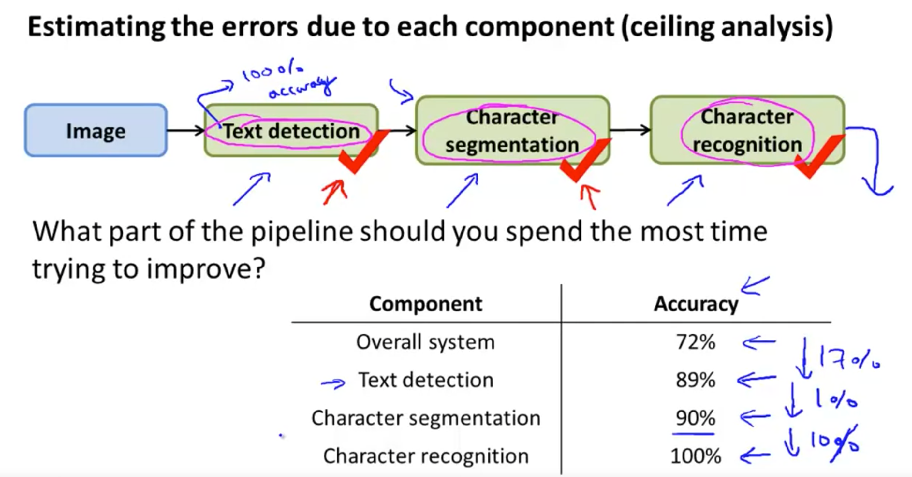

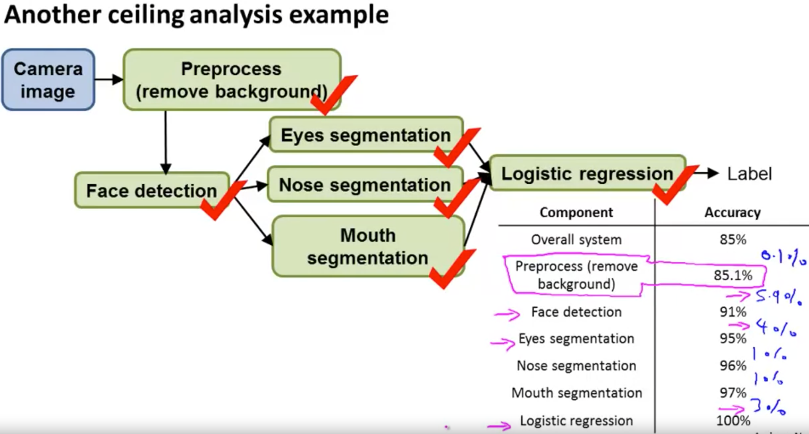

下面这个问题也回答错了⬇️
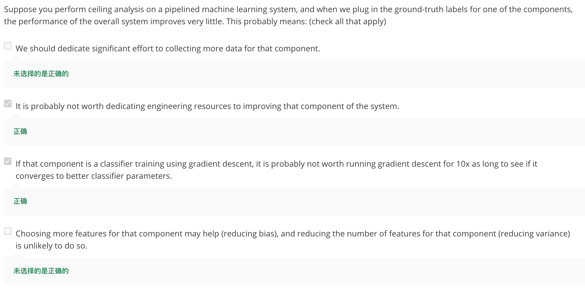

