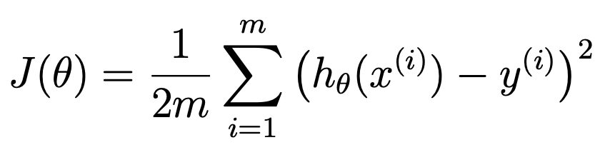
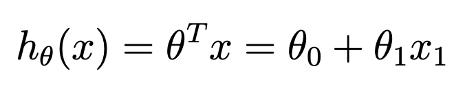
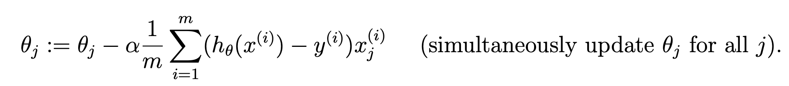
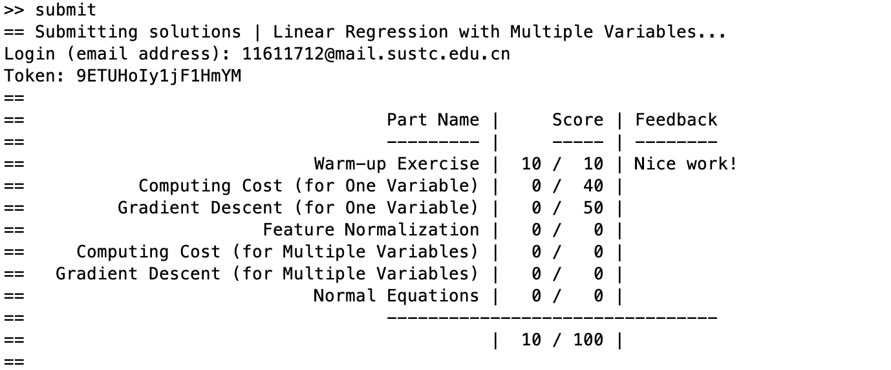
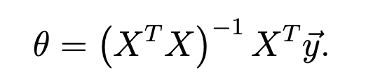

# ex1.m
⚠️检测最终结果的代码。重要！

## 第一步：warmUpExercise.m
## 第二步：plotData.m
## 第三步：computeCost.m

```matlab
X = [ones(m, 1), data(:,1)]; % Add a column of ones to x
theta = zeros(2, 1); % initialize fitting parameters

% Some gradient descent settings
iterations = 1500;
alpha = 0.01;
```
如何理解这里的 X？在学习视频中，我们知道 bias 需要添加一个 1*bias。
[A, B] 就是能把 矩阵（或向量）A 和 矩阵（或向量）B 横向排列起来，所以需要行的数量相同。

## 第四步：gradientDescent.m

## 第五步：可视化 J，也就是训练效果
最优的 theta 取值： -3.6303，1.1664
所以下面模拟了一系列取值：
```matlab
% Grid over which we will calculate J
theta0_vals = linspace(-10, 10, 100);
theta1_vals = linspace(-1, 4, 100);
```
最后画了一个J值图：可以看到我们的最优值确实在最低点的位置。

还有一个轮廓图，详情可见下面 matlab 中的作图部分。

# warmUpExercise.m
只是为了了解怎样执行代码的一个小任务。

# plotData.m
完成数据的可视化。

# computeCost.m

对应公式：


```matlab
J = 0;
for i = 1 : m
    J = J + (X(i, :) * theta - y(i))^2;
end

J = J / (2 * m);
```
按照公式，maybe 我该把 theta 写在前面，转制一下...

# gradientDescent.m

对应公式：


```matlab
temp_sum1 = 0;
temp_sum2 = 0;

for i = 1 : m
    temp_sum1 = temp_sum1 + (X(i, :) * theta - y(i));
    temp_sum2 = temp_sum2 + (X(i, :) * theta - y(i)) * X(i, 2);
end


theta(1) = theta(1) - alpha / m * temp_sum1;
theta(2) = theta(2) - alpha / m * temp_sum2;
```
这里对于最后 X 的摆放纠结了半天...傻了我，忘记 X 的第一列为 1，还一直在想 X 不是只有一列数嘛。。

# 如何提交代码？
So easy！在 command window 中输入 `submit`，根据提示输入邮箱和密码即可！


# 数据介绍

## 数据1
第一列：population of a city
第二列：the profit of a food truck in that city

## 数据2
第一列：the size of the house (in square feet)
第二列：the number of bedrooms
第三列：the price of the house

# ex1_multi.m

## 第一步：featureNormalize.m
## 第二步：computeCostMulti.m
## 第三步：gradientDescentMulti.m
手动设置 learning rate，如果设置的很好，就会得到像下面这张图：


(i.e., 0.3, 0.1, 0.03, 0.01 and so on)

最后做个测试，看看测试集怎么得到结果：
```matlab
test_X = [1650 3];
for i=1:size(test_X, 2)
    test_X(:, i) = (test_X(:, i) - mu(:, i)) / sigma(:, i);
end
price = [1 test_X] * theta; % You should change this
```
## 第四步：normalEqn.m
```matlab
theta = pinv(X'*X)*X'*y;
```


注意在使用这种方法时，就不需要正则化啦。所以测试时不要搞混了。

# featureNormalize.m
```matlab
% 写法1
% for i=1:size(X_norm, 2)
%     mu(:, i) = mean(X_norm(:, i));
%     sigma(:, i) = std(X_norm(:, i));
%     X_norm(:, i) = (X_norm(:, i) - mu(:, i)) / sigma(:, i);
% end

% 写法2
mu = mean(X_norm);
sigma = std(X_norm);
for i=1:size(X_norm, 2)
    X_norm(:, i) = (X_norm(:, i) - mu(:, i)) / sigma(:, i);
end
```
一直怀疑自己是不是哪里错了...原来没有问题，后面出现的图一直误导我qwq
还挺简单的写法，记住：这里的 mu 和 sigma 需要存储起来，以后测试集也需要用到；另这个方程的输入 X 还没有加过一列 1，所以放心大胆的正则化吧～

# computeCostMulti.m


和之前保持一致，不需要改动。

# gradientDescentMulti.m

```matlab
    temp_sum = zeros(1, size(X, 2));

    for i = 1 : m
        for j = 1: size(X, 2)
            temp_sum(j) = temp_sum(j) + (X(i, :) * theta - y(i)) * X(i, j);
        end
    end
    
    for i = 1 : size(X, 2)
        theta(i) = theta(i) - alpha / m * temp_sum(i);
    end
```
原来只支持一个 feature，现在用了循环就支持 mult-features 了。

# normalEqn.m


```matlab
theta = zeros(size(X, 2), 1); %原来就有
theta = pinv(X'*X)*X'*y;
% theta = theta + pinv(X'*X)*X'*y; %如果你想除去因为赋值没用到的小红线，可以加一个 theta 反正都是 0 也没关系
```
收官～
# matlab 学习

## 初始化
```matlab
%% Initialization
clear ; close all; clc
```

## 暂停程序
```matlab
pause;
```
可以通过按下 enter 键继续

## console 输出
```matlab
fprintf('Program paused. Press enter to continue.\n');
```

## load 数据
```matlab
data = load('ex1data1.txt');
X = data(:, 1); y = data(:, 2);
m = length(y); % number of training examples
```
超级方便，`load`函数加上路径就行，`data(A, B)`其中A表示行，B表示列。⚠️matlab的索引从 1 开始。
长度用 `length` 函数。

## 画图
```matlab
figure; % open a new figure window
plot(x, y, 'rx', 'MarkerSize', 10); % Plot the data 
ylabel('Profit in $10,000s'); % Set the y−axis label 
xlabel('Population of City in 10,000s'); % Set the x−axis label
```
其中 `rx` 中 `r` 表示红色，`x`表示叉叉。
效果如下：


继续做图
```matlab
% Plot the linear fit
hold on; % keep previous plot visible
plot(X(:,2), X*theta, '-')
legend('Training data', 'Linear regression') %看样子根据顺序标注数据？
hold off % don't overlay any more plots on this figure
```
效果如下：


```matlab
% Because of the way meshgrids work in the surf command, we need to
% transpose J_vals before calling surf, or else the axes will be flipped
J_vals = J_vals';
% Surface plot
figure;
surf(theta0_vals, theta1_vals, J_vals)
xlabel('\theta_0'); ylabel('\theta_1');
```
可以看到我们的最优值确实在最低点的位置。

```matlab
% Contour plot
figure;
% Plot J_vals as 15 contours spaced logarithmically between 0.01 and 100
contour(theta0_vals, theta1_vals, J_vals, logspace(-2, 3, 20))
xlabel('\theta_0'); ylabel('\theta_1');
hold on;
plot(theta(1), theta(2), 'rx', 'MarkerSize', 10, 'LineWidth', 2);
```
同理，我们有一个轮廓图：

