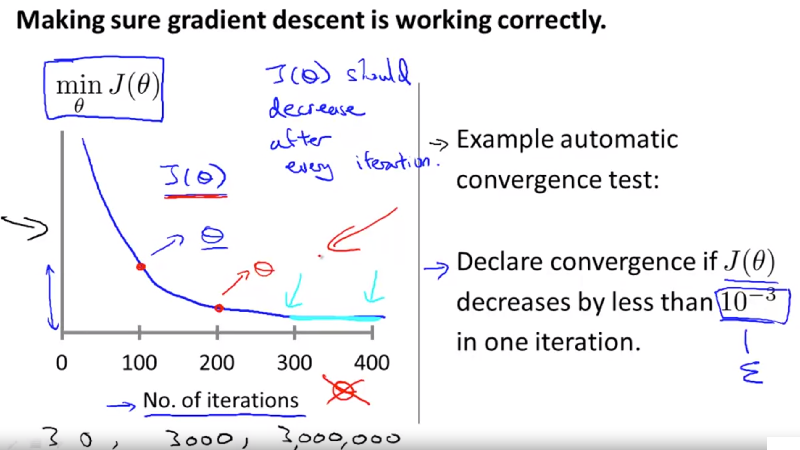
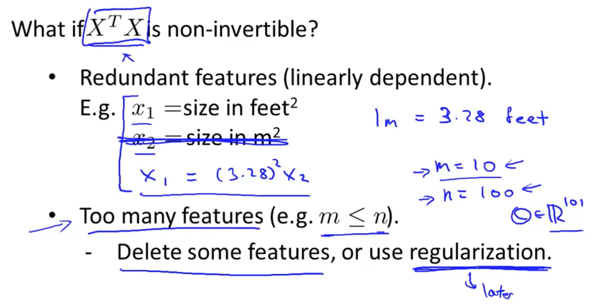

作业会使用 Octave 或 MATLAB 完成，看上去是二选一的样子，那我就选 MATLAB 吧～

# Multivariate Linear Regression

**一些 Notations：**
n = # of features
$x^{(i)}$ = input (features) of $i^{th}$ training example
$x^{(i)}_j$ = value of feature $j$ in $i^{th}$ training example

```mathjax
h_{\theta}(x)=\theta_{0}+\theta_{1} x_{1}+\theta_{2} x_{2}+\theta_{3} x_{3}+\cdots+\theta_{n} x_{n}
```

```mathjax
h_{\theta}(x)=\left[\begin{array}{llll}\theta_{0} & \theta_{1} & \dots & \theta_{n}\end{array}\right]\left[\begin{array}{c}x_{0} \\ x_{1} \\ \vdots \\ x_{n}\end{array}\right]=\theta^{T} x
```
**那么如何解决多变量线性回归问题呢？**


**Feature Scaling**
* Idea: Make sure features are on a similar scale.
* 目的：使得梯度下降更快收敛
* 操作：Get every feature into approximately a -1<=x_i<=1 range.
* 数量级倍的多和少都不合适，需要标准化
* 吴恩达的经验：-3～3 / -1/3～1/3 在生活实践中作为一个分界线很好


**Mean Normalization**
定义：subtracting the average value for an input variable from the values for that input variable resulting in a new average value for the input variable of just zero.
```mathjax
x_{i}:=\frac{x_{i}-\mu_{i}}{s_{i}}
```
Where $\mu_{i}$ is the average of all the values for feature (i) and $s_{i}$ is the range of values $(\max -\min ),$ or $s_{i}$ is the standard deviation.

**在实践中，我们该如何判断梯度下降的训练是OK的呢？**
我们通常是通过下面这张图可以来判断：

它的整体趋势必然是下降的！可以通过一次迭代下降的大小来定义算法的收敛。下图展示了不OK的情况：


吴恩达说，在实际情况下，学习率都是试出来的，他通常会采用下面这张方法不断尝试：


**Polynomial Regression**

这种情况一定要注意正则化的问题！！

# Computing Parameters Analytically

**Normal equation**
* 求解 $\theta$ 的解析解法
* 一步到位，不像梯度下降需要很多步迭代
* 公式计算：
```mathjax
\theta=\left(X^{T} X\right)^{-1} X^{T} y
```

其中 X 的定义如下图所示：


另外，关于输入数据的正则化，对于 Normal Equation 这个方法来说是不必要的，而对于 Gradient Descent 是必须的！[red]

既然现在我们有两种方法来解决线性回归的问题，那么**我们到底采用哪种方法呢？**吴恩达倾向于在 n=10000 或更大时考虑梯度下降算法。矩阵求逆的复杂度=$O(n^3)$


补充（该公式详细推导过程）：[详解正规方程（Normal Equation） - 知乎](https://zhuanlan.zhihu.com/p/60719445) 我已经照着推倒了一遍记录在 ipad 的 notability 软件中！

应广大同学要求，补充的一个小知识：


`pinv` 函数 VS `inv` 函数：前者在不可逆的情况下仍然能给出一个解。


# Octave/Matlab Tutorial
没怎么看...要用时再说吧 根据检测结果，我搞不太清楚 .* 的结果。


