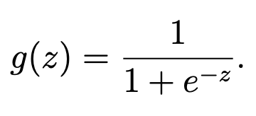
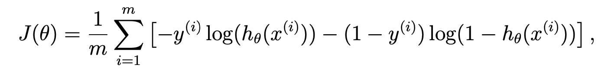
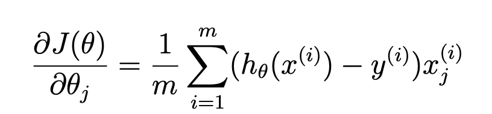
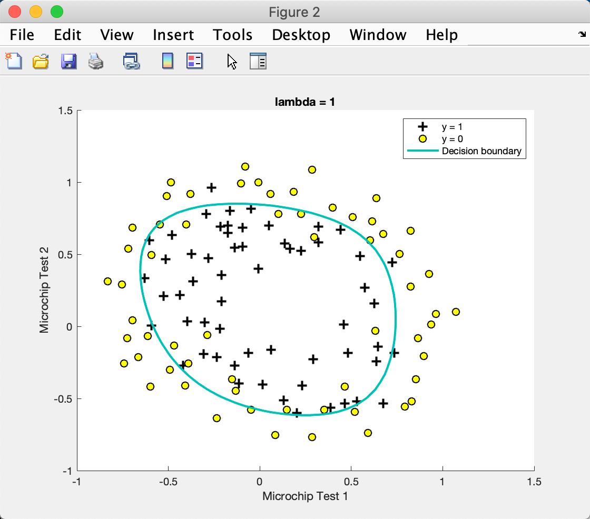
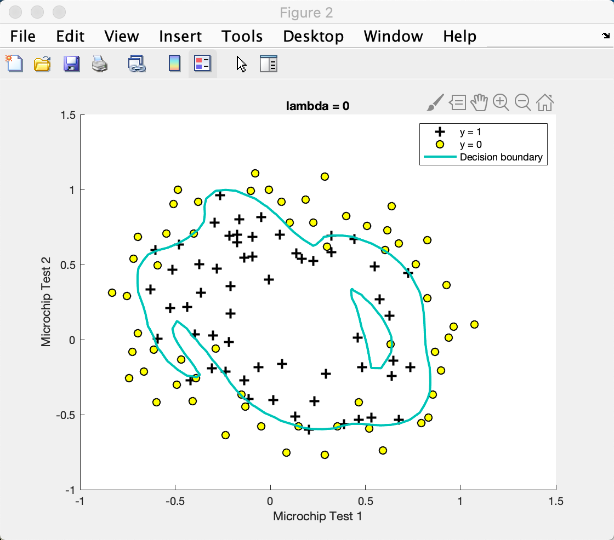
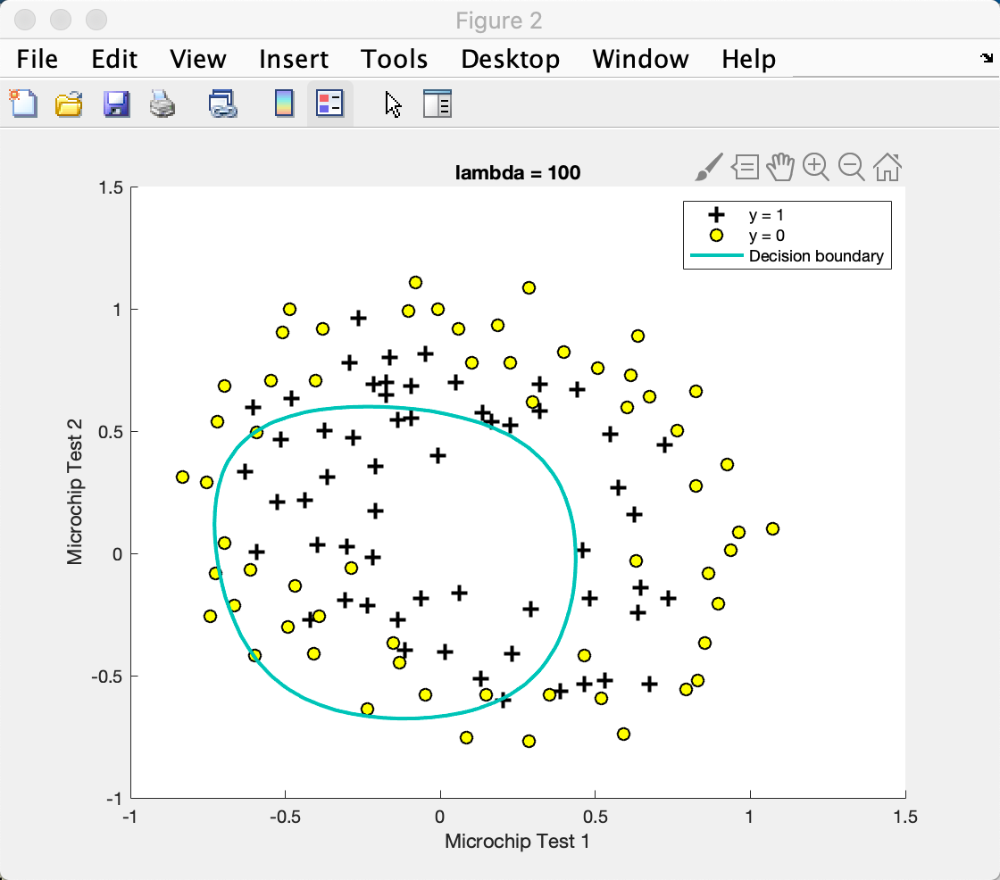
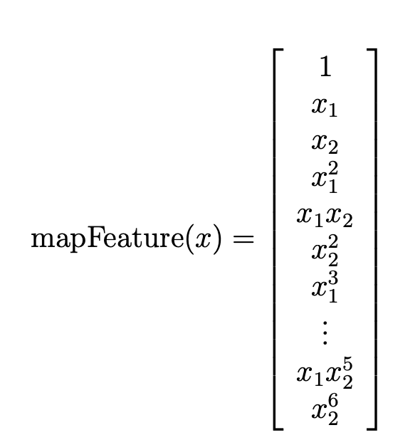
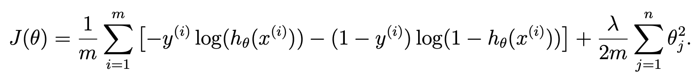
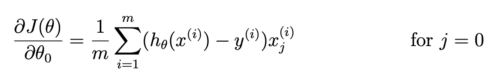
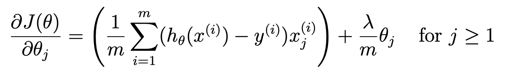

这次练习的目标是通过学生的两次考试成绩来预测这个学生是否能被录取，这是一个分类问题，我们通过逻辑回归来解决该问题。

第二个问题是 制造工厂的微芯片通过了质量保证（QA）。

# submit.m
前一个练习也有这个，但没注意看。
```matlab
function out = output(partId, auxstring)
  % Random Test Cases
  X = [ones(20,1) (exp(1) * sin(1:1:20))' (exp(0.5) * cos(1:1:20))'];
  y = sin(X(:,1) + X(:,2)) > 0;
  if partId == '1'
    out = sprintf('%0.5f ', sigmoid(X));
  elseif partId == '2'
    out = sprintf('%0.5f ', costFunction([0.25 0.5 -0.5]', X, y));
  elseif partId == '3'
    [cost, grad] = costFunction([0.25 0.5 -0.5]', X, y);
    out = sprintf('%0.5f ', grad);
  elseif partId == '4'
    out = sprintf('%0.5f ', predict([0.25 0.5 -0.5]', X));
  elseif partId == '5'
    out = sprintf('%0.5f ', costFunctionReg([0.25 0.5 -0.5]', X, y, 0.1));
  elseif partId == '6'
    [cost, grad] = costFunctionReg([0.25 0.5 -0.5]', X, y, 0.1);
    out = sprintf('%0.5f ', grad);
  end 
end
```
可以看出 submit.m 是按照作业要求一次执行了对应的代码片段，得到结果后传递给远程服务器，由服务器返回评测结果。其中还涉及到 token 的验证和存储，还是挺基础的代码的。

# ex2.m
## 第一步：plotData.m
## 第二步：sigmoid.m
## 第三步：costFunction.m
## 第四步：Optimizing using fminunc
```matlab
%  Set options for fminunc
options = optimset('GradObj', 'on', 'MaxIter', 400);

%  Run fminunc to obtain the optimal theta
%  This function will return theta and the cost 
[theta, cost] = ...
	fminunc(@(t)(costFunction(t, X, y)), initial_theta, options);
```
参数 GradObj 是用户定义的目标函数的梯度，这里将优化选项结构 GradObj 设置为 ’on’ 来提供梯度信息，允许 fminunc 在最小化代价函数时使用梯度下降。MaxIter 是最大迭代次数，这里设置为400次，也就是告诉 fminunc 接下来最多运行400步。还可加上参数'Display'，其value可设置为：'off' 表示不显示输出， 'iter' 显示每次迭代的结果，'final' 只显示最终结果，'notify' 只在函数不收敛的时候显示结果。
摘自[这里](https://www.jianshu.com/p/5f8248117c99)

综上，理解语句[theta, cost] = fminunc(@(t)(costFunction(t, X, y)), initial_theta, options)的意思为：
（1）@(t)(costFunction(t, X, y)为匿名函数，原本函数costFunction为输入三个参数theta,X,y输出两个参数J,gradient，通过匿名函数后，其输入参数变成一个t，另外两个参数X,y变成固定值（X,y前面已经定义），故该表达符合fminunc函数的第一个输入参数，即输入为函数，且该函数仅有一个输入，输出第一个值为计算的最小值，输出第二个值为用户自定义梯度计算值；
（2）initial_theta为寻找局部最小值的起始位置；
（3）options为函数fminunc的优化配置，即最大迭代次数为400，用户梯度函数设置为On；
（4）根据解释[X,FVAL] = fminunc(FUN,X0,…) returns the value of the objective function FUN at the solution X。
[theta, cost] = fminunc(@(t)(costFunction(t, X, y)), initial_theta, options)表示的是返回函数costFunction的局部最小值，其在点theta处，函数costFunction在theta处值为cost。
摘自 [这里](https://blog.csdn.net/meijie2018_1/article/details/89810485)

## 第五步：plotDecisionBoundary.m
## 第六步：predict.m

# plotData.m
可视化数据，具体内容见底下 `matlab学习` 中的画图部分。

# sigmoid.m

```matlab
g = zeros(size(z));
for i = 1:size(z, 1)
    for j = 1:size(z, 2)
        g(i, j) = g(i, j) + 1/(1+exp(-z(i, j)));
    end
end
```
比较简单，就是注意一下维度，z 不是一个值，它可能是一个向量或一个矩阵。

# costFunction.m



```matlab
m = length(y);
J = 0;
grad = zeros(size(theta));
for i=1:m
    h = sigmoid(theta' * X(i));
    J = J - y(i)*log(h) - (1-y(i))*log(1-h);
    for j=1:size(theta)
        grad = (h - y(i)) * X(i, j);
    end
end
J = J / m;
grad = grad / m;
```
还挺简单的照着写，然而我发现我搞错了。。。此时 X 的维度是 （m, n+1）; theta 的维度是（n+1，1）；y 的维度是（m，1）一定要注意点乘！！！

```matlab
h = sigmoid(X * theta);
J = J + sum(-y .* log(h) - (1-y) .* log(1-h)) / m;
grad = grad + X' * (h - y) / m;
```
# plotDecisionBoundary.m
作用就是画一条分隔线。代码写的很清楚，分类讨论，如果是一条线两点就能确定；否则需要用轮廓图画。前面部分很好理解，要画出y相对x的方程；~~后面部分好像只是画了grid range，不太清楚有啥用。。。~~
在第二道题中，由于我们需要自己新创建 feature，导致 X 维度巨大，完全大于 2 了！这个时候怎么画轮廓线呢？ y 依然等于 X * theta，当然这里的 X 是映射后的 X。其实他们用的也不是 X，而是 linspace 生成的一组数，这样画起来比较均匀吧。

```matlab
if size(X, 2) <= 3
    % Only need 2 points to define a line, so choose two endpoints
    plot_x = [min(X(:,2))-2,  max(X(:,2))+2];

    % Calculate the decision boundary line
    plot_y = (-1./theta(3)).*(theta(2).*plot_x + theta(1));

    % Plot, and adjust axes for better viewing
    plot(plot_x, plot_y)
    
    % Legend, specific for the exercise
    legend('Admitted', 'Not admitted', 'Decision Boundary')
    axis([30, 100, 30, 100])
else
    % Here is the grid range
    u = linspace(-1, 1.5, 50);
    v = linspace(-1, 1.5, 50);

    z = zeros(length(u), length(v));
    % Evaluate z = theta*x over the grid
    for i = 1:length(u)
        for j = 1:length(v)
            z(i,j) = mapFeature(u(i), v(j))*theta;
        end
    end
    z = z'; % important to transpose z before calling contour

    % Plot z = 0
    % Notice you need to specify the range [0, 0]
    contour(u, v, z, [0, 0], 'LineWidth', 2)
end
```
> contour(X,Y,Z) draws a contour plot of Z using vertices from the mesh defined by X and Y. X and Y can be vectors or matrices.
 
# predict.m
```matlab
y = X * theta;
y_pos = find(y>=0);
y_neg = find(y<0);

p(y_pos) = 1;
p(y_neg) = 0;
```

# ex2 reg.m
## 第一步：plotData.m
可以看出没办法通过一条直线区分开两种分类，所以需要靠下一步的映射来创造新的特征。
## 第二步：mapFeature.m
## 第三步：costFunctionReg.m
## 第四步：Optimizing using fminunc
```matlab
% Set regularization parameter lambda to 1 (you should vary this)
lambda = 1;

% Set Options
options = optimset('GradObj', 'on', 'MaxIter', 400);

% Optimize
[theta, J, exit_flag] = ...
	fminunc(@(t)(costFunctionReg(t, X, y, lambda)), initial_theta, options);
```
下面是不同 lambda 取值效果：



# mapFeature.m

```matlab
degree = 6;
out = ones(size(X1(:,1)));
for i = 1:degree
    for j = 0:i
        out(:, end+1) = (X1.^(i-j)).*(X2.^j);
    end
end
```
⚠️ 掌握一个新用法 `end+1` ! 据神奇！一开始我还理解不了，不是明明 out 的维度固定了吗... 其实这里的 `end+1` 是指在原来向量的基础上多加一列数！

就如上面图片的公式所示，我们第一列全是 1，第二列开始各种 x1 和 x2 的组合。

> means that you are assigning a value to the next position, which automatically **extends the array** to fit that size.

# costFunctionReg.m




```matlab
temp_theta = theta;
temp_theta(1) = 0;

h = sigmoid(X * theta);
J = J + sum(-y .* log(h) - (1-y) .* log(1-h)) / m + lambda * sum(temp_theta .^ 2) / (2 * m);
grad = grad + X' * (h - y) / m + lambda * temp_theta / m;
```
跑跑代码最后的分类效果还有模有样，但是 submit 却错了。仔细看公式发现 theta0 是个特殊情况需要特殊对待！！！

# matlab 学习

## 画图
学到了两点：一使用 `find` 函数；二 `X(pos, 1)` 可以直接使用 `pos` 来一键选中所有 pos 类的值。
```matlab
pos = find(y==1);
neg = find(y==0);

plot(X(pos, 1), X(pos, 2), 'k+', 'LineWidth', 2, 'MarkerSize', 7);
plot(X(neg, 1), X(neg, 2), 'ko', 'MarkerFaceColor', 'y', 'MarkerSize', 7);
```
