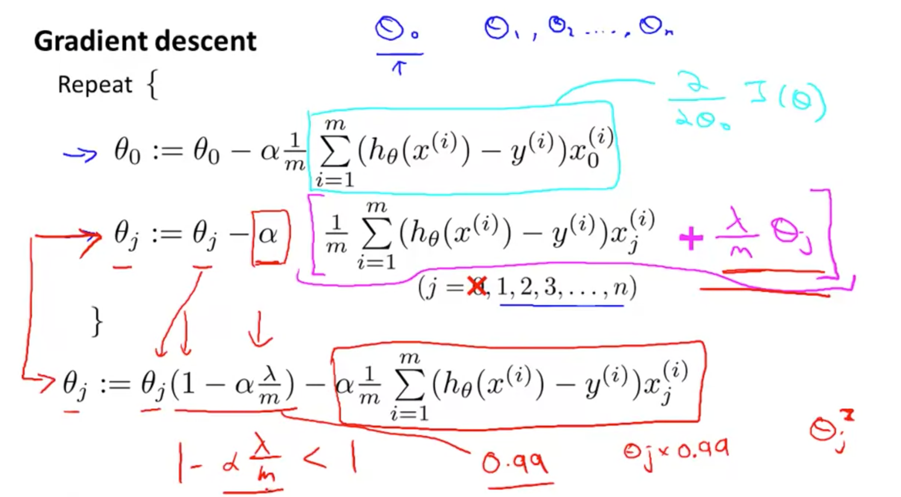
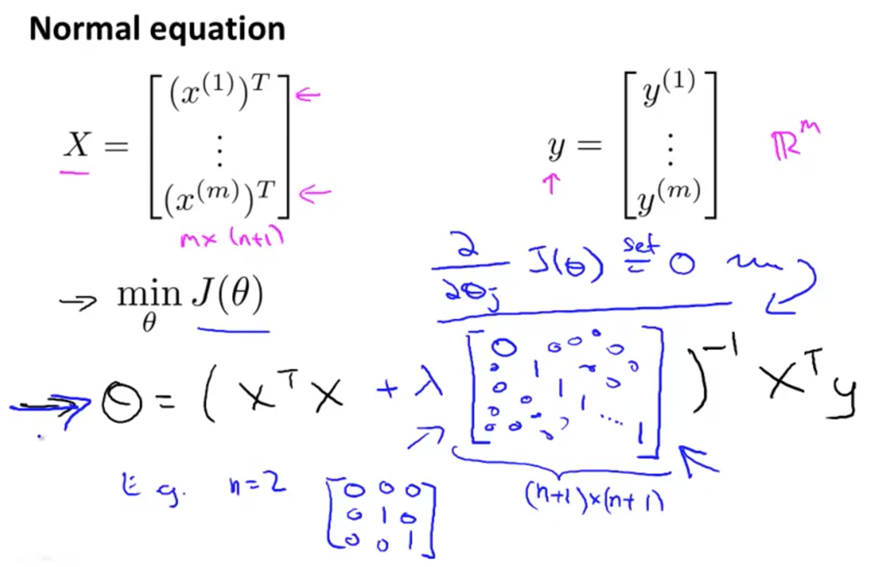

# Classification and Representation

首先以 Linear Regression 的思路，尝试解决分类问题，通过最后使用一个 threshold 区分。分析了这种做法存在的问题，尝试一种新的方法：Logistic Regression。（不要疑惑这里有 Regression 回归，这是历史遗留问题，其实它是一个分类算法！）


**逻辑回归模型长什么样子呢？**

* 定义了逻辑回归的公式 （为了得到0到1范围值提出来的）
* 同时也被称为 Sigmoid / Logistic function
* 了解了逻辑回归 x-y 曲线图


**那我们该如何解释逻辑回归得到的值呢？** 可以把它看作一种概率！


**Decision Boundary**: 它是由 hypothesis 和 parameters 决定的，和 dataset 没有关系。

**Non-linear decision boundaries**


# Logistic Regression Model

**如何定义 cost function 呢？** 如果我们按照 Linear regression 的来，我们会发现最后 $J$ 相对于 $\theta$ 是一个非凸函数，有很多个 local minimum，无法通过梯度下降训练得到 global minimum。**所以怎么做呢？**


**我们考虑换一个 cost function**。如何理解这个函数的设定呢？当实际 y=1 时，如果预测出来 h=1，那么不需要惩罚；反之预测出来 h=0，那么需要大大的惩罚！


当 y=0 时，同理，这里就不贴图了。

Q: why this function? [red]
A: this cost function can be derived from **statistics** using the principle of **maximum likelihood estimation**, which is an idea in statistics for how to efficiently find parameters' data for different models. [red]

And it also has a nice property that it is **convex**. So this is the cost function that essentially everyone uses when fitting logistic regression models. [red]
- - - - - 

**总结一下前面的内容：**


**这个 cost function 可以被简单地归纳到一个方程中，我们还是通过梯度下降算法来训练模型：**


**Advanced Optimization**

下面三个方法虽好，但实现起来非常复杂，吴恩达说数值计算的专家才比较好理解...劝退了[red]

**对于这些好的算法，我们只需要当一个调包侠！**


```
function [jVal, gradient] = costFunction(theta)
  jVal = [...code to compute J(theta)...];
  gradient = [...code to compute derivative of J(theta)...];
end

options = optimset('GradObj', 'on', 'MaxIter', 100);
initialTheta = zeros(2,1);
   [optTheta, functionVal, exitFlag] = fminunc(@costFunction, initialTheta, options);
```

# Multiclass Classification

**One-vs-all**
对每个类训练一个逻辑回归分类器：


从中选择概率最大的那个作为最后的分类预测：


# Solving the Problem of Overfitting
underfit = high bias
overfit = high variance

有两种思路，一种就是简化特征，除去那些相关性很强的特征；一种就是正则化，保证在具有很多特征的时候参数 $\theta$ 值都很小。


**正则化如何应用到 cost function 中呢？**

⚠️这里有个专业术语：**Regularization Parameters** 这里的正则化参数是从 j=1 记起，而不是0，只是遵从惯例，改成0其实变化不大。

**得到了 cost function 之后，我们该如何通过梯度下降训练呢？**

⬇️

首先因为正则化从 1 开始，所以我们要单独把 0 拎出来。接着在从1开始的公式中添加正则化参数的导数值即可。
⚠️$1-\alpha * \lambda / m < 1$ 从正则化意义角度理解：我们就是想最小化参数 $\theta$；从实际取值出发：$\alpha$ 一般非常非常小，所以最终结果比 1 小。

**如果我们想把正则化技术应用到 Normal equation 求解中，该怎么做？**

* L is a matrix with 0 at the top left and 1's down the diagonal, with 0's everywhere else. 
* It should have dimension (n+1)×(n+1). 
* ~~我没搞明白为什么这里加一个像 identity matrix 一样的矩阵就可以？这是规定的，还是有什么能推导出来的？毕竟在梯度下降里多了 n 个参数，这里只多了 1 个参数？~~ 矩阵推导可以解决这个问题


在 Normal equation 求解中应用正则化技术有一个好处，那就是它使得矩阵必定是可逆的！~~当然，这里咋证明的我也没去 figure out~~ 已理解

**最后来展示展示加入正则化技术的代码咋写：**


# 练习题

这道题做了两遍也没做对，记录一下：

