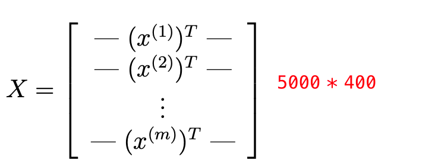
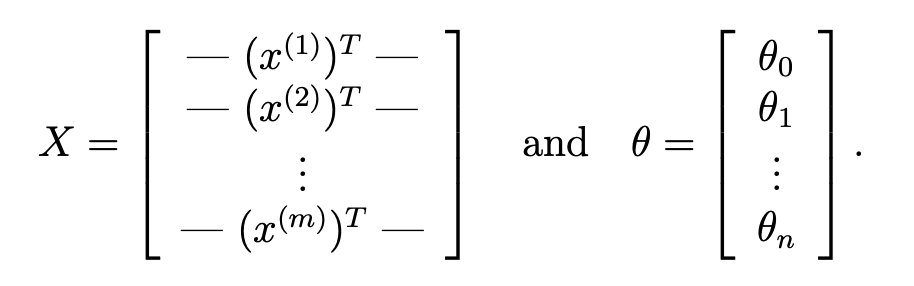
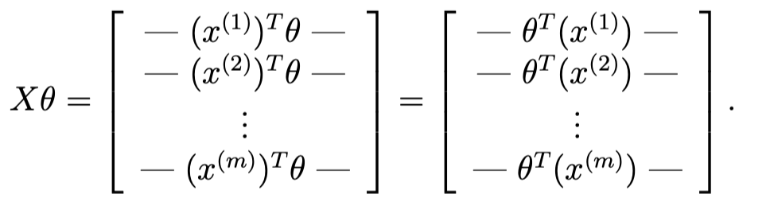
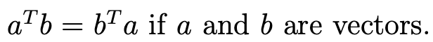
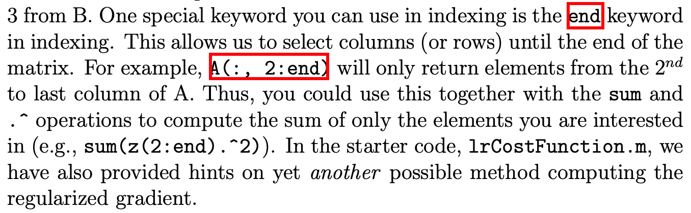

需要完成：
1.one-vs-all logistic regression
2.neural networks

数据说明：
手写数字
* 5000 training examples
* 20 pixel by 20 pixel grayscale image
* “unrolled” into a 400-dimensional vector
* a “0” digit is labeled as “10”, while the digits “1” to “9” are labeled as “1” to “9” in their natural order


# ex3.m
## 第一步：displayData.m
## 第二步：lrCostFunction.m
## 第三步：oneVsAll.m
## 第四步：predictOneVsAll.m


# displayData.m

displayData(X, example_width) 有两个参数，但实际只传入了一个参数。第二个参数是要得到一张图片的边长。
```Matlab
% Set example_width automatically if not passed in
if ~exist('example_width', 'var') || isempty(example_width) 
	example_width = round(sqrt(size(X, 2)));
end
```
剩余代码：
```matlab
% Gray Image
colormap(gray);

% Compute rows, cols
[m n] = size(X);
example_height = (n / example_width);

% Compute number of items to display
display_rows = floor(sqrt(m));
display_cols = ceil(m / display_rows);

% Between images padding
pad = 1;

% Setup blank display
display_array = - ones(pad + display_rows * (example_height + pad), ...
                       pad + display_cols * (example_width + pad));

% Copy each example into a patch on the display array
curr_ex = 1;
for j = 1:display_rows
	for i = 1:display_cols
		if curr_ex > m, 
			break; 
		end
		% Copy the patch
		
		% Get the max value of the patch
		max_val = max(abs(X(curr_ex, :)));
		display_array(pad + (j - 1) * (example_height + pad) + (1:example_height), ...
		              pad + (i - 1) * (example_width + pad) + (1:example_width)) = ...
						reshape(X(curr_ex, :), example_height, example_width) / max_val;
		curr_ex = curr_ex + 1;
	end
	if curr_ex > m, 
		break; 
	end
end

% Display Image
h = imagesc(display_array, [-1 1]);

% Do not show axis
axis image off

drawnow;
```

# lrCostFunction.m
Vectorizing the cost function





check 了一下 week3 写的代码，发现当时已经向量化了。。所以没有修改半点代码。。。

# oneVsAll.m
提示是真的多。。基本抄抄抄完事。
```matlab
for i=1:num_labels
    initial_theta = zeros(n + 1, 1);
    options = optimset('GradObj', 'on', 'MaxIter', 50);
    [theta] = fmincg (@(t)(lrCostFunction(t, X, (y == i), lambda)), ...
                initial_theta, options);
    all_theta(i,:)=theta';
end
```
# predictOneVsAll.m
mark一下这个用法，max函数得到的结果，第一个为最大值的值，第二个为最大值的index。
```matlab
result = sigmoid(X * all_theta');
[max_value, max_index] = max(result, [], 2);
p = max_index';
```

# ex3 nn.m
这次两个题目都是一样，数据集也一样。


这里只需要我们实现 predict.m 方法。
## 第一步：displayData.m
## 第二步：Loading Pameters
## 第三步：predict.m
# predict.m
比较简单。。看一下维度大概就知道咋写了。
```matlab
a1 = [ones(m, 1) X];
a2 = [ones(m, 1) sigmoid(a1 * Theta1')];
a3 = sigmoid(a2 * Theta2');
[max_value, max_index] = max(a3, [], 2);
p = max_index';
```

# fmincg.m
Function minimization routine (similar to fminunc) 辅助函数，已提供。用于 One-vs-all Classification。
说明：fmincg works similarly to fminunc, but is more more efficient for dealing with
a large number of parameters.
看代码比较复杂，懒懒的我不准备研究了。
# sigmoid.m
Sigmoid function 辅助函数，已提供。

# matlab 学习
## load 数据
```matlab
% Load saved matrices from file
load('ex3data1.mat');
% The matrices X and y will now be in your Octave environment
```
超级简单的语法！
## end 关键字
在week3的练习中就遇到过，这里官方也建议了这个用法，不过我觉得更好的用法应该是省略end，默认会到最后。

## 画图那些事儿
不显示坐标轴：`axis image off`
`imagesc`
 imagesc Display image with scaled colors
    imagesc(...) is the same as IMAGE(...) except the data is scaled
    to use the full colormap.
 
    imagesc(...,CLIM) where CLIM = [CLOW CHIGH] can specify the
    scaling.
`drawnow`
  drawnow Update figure windows and process callbacks
      
  drawnow updates figures and processes any pending callbacks. Use this
  command if you modify graphics objects and want to see the updates on the
  screen immediately.
## randperm
P = randperm(N) returns a vector containing a random permutation of the
    integers 1:N.  For example, randperm(6) might be [2 4 5 6 1 3].

## exist
 exist  Check existence of variable, script, function, folder, or class
    exist(NAME) returns:
      0 if NAME does not exist
      1 if NAME is a variable in the workspace
      2 if NAME is a file with extension .m, .mlx, or .mlapp, or NAME
        is the name of a file with a non-registered file extension 
        (.mat, .fig, .txt).
      3 if NAME is a MEX-file on the MATLAB search path
      4 if NAME is a Simulink model or library file on the MATLAB search path
      5 if NAME is a built-in MATLAB function. This does not include classes
      6 if NAME is a P-code file on the MATLAB search path
      7 if NAME is a folder
      8 if NAME is a class (exist returns 0 for Java classes if you
        start MATLAB with the -nojvm option.)
 
    exist('NAME','builtin') checks only for built-in functions.
    exist('NAME','class') checks only for classes.
    exist('NAME','dir') checks only for folders.
    exist('NAME','file') checks for files or folders.
    exist('NAME','var') checks only for variables.