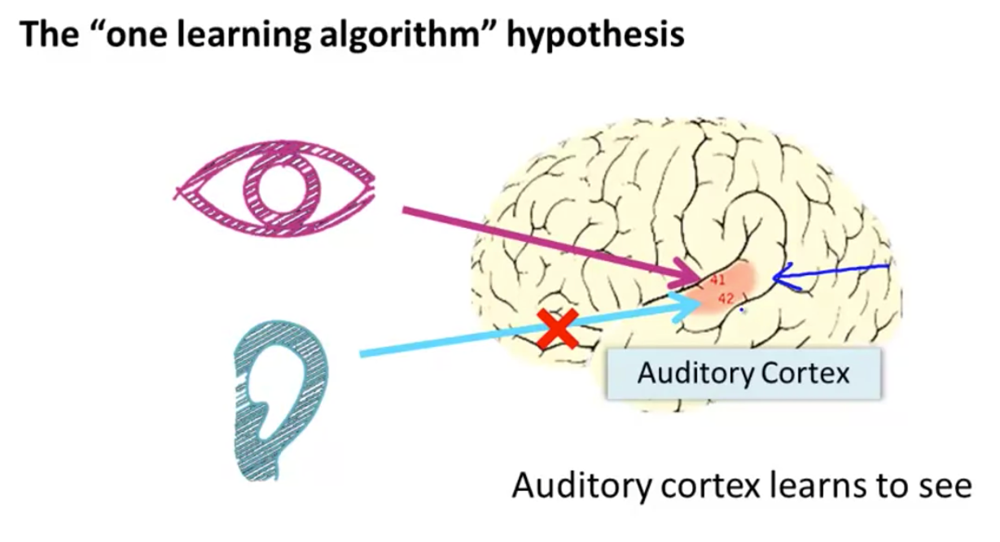
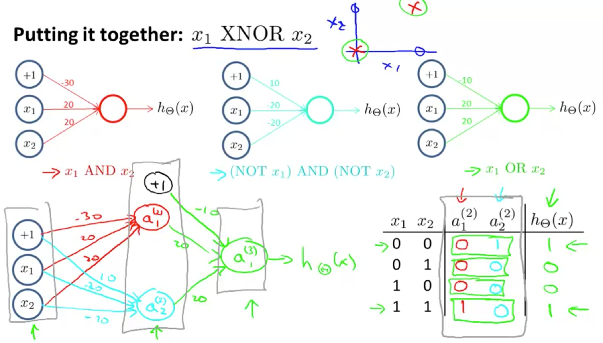
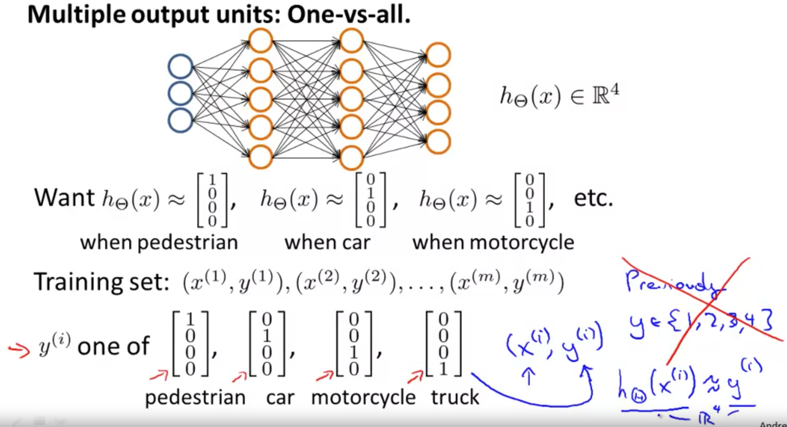
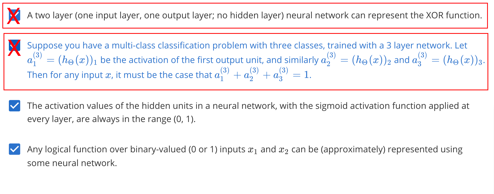
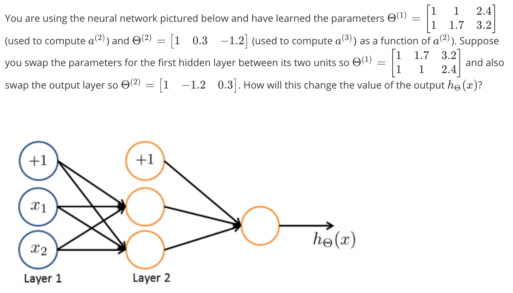

# Motivations
介绍神经网络，很喜欢恩达举的例子：

可以看出感官信号是可以相互转换的！想到多年前叶李华老师曾说，有些小孩子通过触摸能判断物体的颜色。现在大概懂了其中的道理，可能小时候大脑有通过触摸感受物体颜色的神经通路？

FDA 曾通过舌头来让盲人“看”世界的设备，也有盲人小孩通过声纳打篮球！

# Neural Networks

dendrites 树突 = input
axons 轴突 = output

**先来看看一个神经元的场景：**

* bias unit 表示 input node $x_0$，它永远等于 1，示意图中一般不画这个节点。
* 原先我们使用的 h 函数，在神经网络的场景一般被叫做 sigmoid (logistic) activation function
* parameters 在这个场景一般被叫做 weights

**多个神经元长这个样子：**

* input / hidden / output layer
* activation units
* parameters 维度计算

**如果我们用向量来表示这些运算：Forward Propagation**

下图表示神经网络可以自己学习到特征之间的组合：

我们注意到，输入不是直接应用 h 函数（简单逻辑回归的做法），而是添加了另一层 a 来学习特征间的关系。

# Applications

简单构造了一个 AND 、 OR 、NOT 函数，这里就不详述了。

**在神经网络中，我们怎么表示多分类问题的输出？**

# Exercise
第一题：B选项是错的，a肯定很随机～其它的话A选项也是错的，脑子里分析一下两个极端都是negative，但中间是positive，很难线性表示的。

最后一题：睡眼朦胧时觉得这题应该增加减少都有可能吧，早上起来仔细看这不对称的嘛，最后的值肯定一样的！

