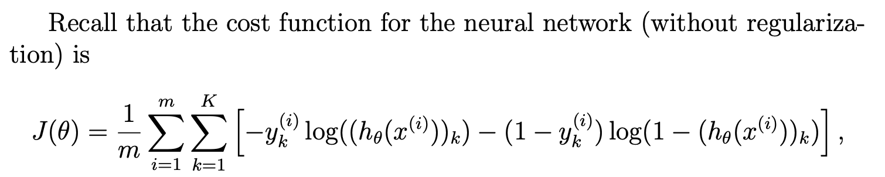
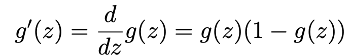
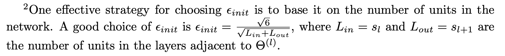
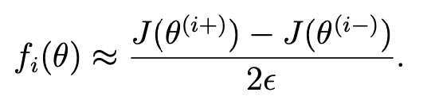

本次数据还是和上一次一样，手写数字识别。总结：好难哇！

# ex4.m
## 第一步：displayData.m
## 第二步：nnCostFunction.m（J和正则化的J）
## 第三步：sigmoidGradient.m
## 第四步：nnCostFunction.m（backpropagation algorithm）


# displayData.m
同前一次练习

# nnCostFunction.m


代码还是很有难度的，对照着上课时的公式。最后正则化记得要除去 bias 的参数！
一直不对，于是去网上找了别人写的代码对比一下。最后发现是 sigmoidGradient 传入的参数传错了，应该是 z 而不是 a。但别人写的代码比我写的好看多了，这里就拿来主义。

这部分有关 forward 的计算，大家都一样：
```matlab
a1 = [ones(m,1) X]; % 5000*401
z2 = a1 * Theta1'; % (5000*401 25x401)->5000*25
a2 = [ones(m,1) sigmoid(z2)]; % 5000*26
z3 = a2 * Theta2'; % (5000*26 10*26)->5000*10
a3 = sigmoid(z3); % 5000*10
```

这里 Y 的使用非常精妙！直接生成对应的列向量！ones(size(hTheta_k)) 和 size(y_k)) 其实是能换成 1 的！
**注意**：最后的 Theta2 不需要 bias 参数。

```matlab
delta3 = zeros(num_labels,m);
Y = eye(num_labels);

% Backpropogation
for i=1:m
    hTheta_k = a3(i,:);

    y_k = Y(:,y(i));
    
    J = J + ((-log(hTheta_k)*y_k)-(log(ones(size(hTheta_k))-hTheta_k)*(ones(size(y_k))-y_k)));
    
    delta3(:,i) = hTheta_k' - y_k;
    delta2(:,i) = Theta2(:,2:end)'*delta3(:,i).*(sigmoidGradient(z2(i,:)))';
end
```

最后正则化，注意一定得从第二个数开始，除去 bias。
```matlab
Theta1_grad = (1/m)*(Theta1_grad + delta2 * a1);
Theta2_grad = (1/m)*(Theta2_grad + delta3 * a2);

Theta1_grad(:,2:end) = Theta1_grad(:,2:end) + (lambda/m) * Theta1(:,2:end); % 25 x 400
Theta2_grad(:,2:end) = Theta2_grad(:,2:end) + (lambda/m) * Theta2(:,2:end); % 10 x 25

J = J / m; % Unregularized cost function
J = J + lambda/(2*m)*(sum(Theta1(:,2:end).^2, 'all')+sum(Theta2(:,2:end).^2, 'all'));

% Unroll gradients
grad = [Theta1_grad(:) ; Theta2_grad(:)];
```

# sigmoid.m
已提供的功能函数，为 sigmoidGradient.m 作准备。

# sigmoidGradient.m

```matlab
g = zeros(size(z));
g_z = sigmoid(z); % 1*26
g = g_z .* (1 - g_z); % 1*26
```
# randInitializeWeights.m

⚠️ 如何选择随机化的参数有一个范围！


```matlab
% Randomly initialize the weights to small values
epsilon_init = 0.12;
W = rand(L_out, 1 + L_in) * 2 * epsilon_init - epsilon_init;
```
# computeNumericalGradient.m


已提供
```matlab
numgrad = zeros(size(theta));
perturb = zeros(size(theta));
e = 1e-4;
for p = 1:numel(theta)
    % Set perturbation vector
    perturb(p) = e;
    loss1 = J(theta - perturb);
    loss2 = J(theta + perturb);
    % Compute Numerical Gradient
    numgrad(p) = (loss2 - loss1) / (2*e);
    perturb(p) = 0;
end
```

 numel   Number of elements in an array or subscripted array expression.
    N = numel(A) returns the number of elements, N, in array A, equivalent 
    to PROD(SIZE(A)).

# checkNNGradients.m
已提供，用于调用 computeNumericalGradient.m。代码写的还不错！

# debugInitializeWeights.m
已提供，为 check gradient 设计的参数初始化。

# fmincg.m
已提供，同前一次练习。

# predict.m
已提供，貌似是之前一期的练习题。
```matlab
% Useful values
m = size(X, 1);
num_labels = size(Theta2, 1);

% You need to return the following variables correctly 
p = zeros(size(X, 1), 1);

h1 = sigmoid([ones(m, 1) X] * Theta1');
h2 = sigmoid([ones(m, 1) h1] * Theta2');
[dummy, p] = max(h2, [], 2);
```


# matlab 学习