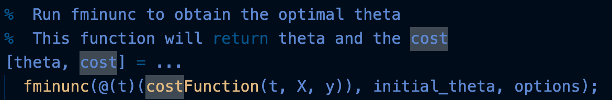

# Cost Function and Backpropagation
**问题重申** 讨论了一些参数的定义 以及 二元分类和多元分类问题的输出。

**Cost Function 计算** 类比之前的逻辑回归，不再只有一个输出单元，取而代之的是K个。

**梯度如何计算？** 之前所用到的是梯度下降算法，这里提出了一个相似的算法：**反向传播算法**（Back Propagation Algorithm）。

前向传播：

反向传播：

PS：我在 notability 中推导了这个 error 计算过程 [red]

- - - - - 

第二个有关反向传递的视频更加深入地介绍整个过程：

delta=partial derivative of the cost function（难怪是对 z 求导）

反向传递的示意图：

# Backprogagation in Practice

two-side 比 one-side 更加精确：

如果有多个参数：

那神经网络的参数怎么挑选呢？
如果全部初始化为0:

**Putting It Together**

> 可能有部分同学之前听说过 一些比较先进的分解方法 可能不需要像这里一样使用 for循环来对所有 m个训练样本进行遍历 但是 这是你第一次进行反向传播算法 所以我建议你最好还是 使用一个for循环来完成程序 对每一个训练样本进行迭代 从x(1) y(1)开始 我们对第一个样本进行 前向传播运算和反向传播运算 然后在第二次循环中 同样地对第二个样本 执行前向传播和反向传播算法 以此类推 直到最后一个样本 
> 因此 在你第一次做反向传播的时候 你还是应该用这样的for循环 来实现这个过程 其实实际上 有复杂的方法可以实现 并不一定要使用for循环 但我非常不推荐 在第一次实现反向传播算法的时候 使用更复杂更高级的方法。

# Application of Neural Networks - Autonomous Driving
很久以前工业界自动驾驶的成果 视频展示

# Exercise
我本来选择了C。。。

看下面的代码也不是很需要 J 来着呀？？？

仔细分析了一下题目，是在说 advanced optimization，所以看起来就在理了。。。[red]

这题完全看不懂题意。。。

别人的解析：先前向再后向且是对应的。
我的理解：看算法的循环 for 是针对一个一个 examples 的。

下面补充几道单元检测：

这道题我漏选了一个，去网上搜网友说是 A、B。好吧，神经网络应该不是凸函数，有局部最优，看起来也能理解。
