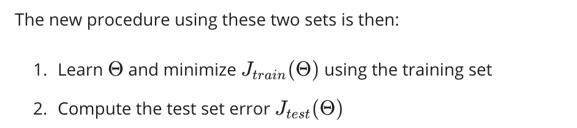

# Evaluating a Learning Algorithm
Debugging a learning algorithm 可能尝试的方向：

下面这个问题就概括了Andrew想说的话：

* split up the data into two sets: a**training set**and a**test set**
* Typically, the training set consists of 70 % of your data and the test set is the remaining 30%.

下面是DL过程的新方法：

前面说的 test set error 该怎么算呢？

- - - - - 
模型选择问题：

假如通过这10个结果选择了d=5，这其实还不是最优的，存在一些问题（因为testing data还是我们拿来做拟合的数据）这时候就引入了交叉验证。

交叉验证数据集怎么分？

Error表示基本一致：

采用交叉验证的 Model Selection：

不选择testing中error最小的，而是选择cross validation中error最小的！！！
⬇️
老师讲了一大串，其实是为了说明这个：

# Bias vs. Variance

如何判断是bias还是variance？

如果加了正则化呢？上面的图会发生怎么样的变化？
（注意这里图中J的公式累加上面应该改为n！！！）

具体操作步骤：

画Learning Curves是一个很好的理解训练状况的方式

下面来分析分析两种case：

经过我们的分析，回到之前的一些debug方法上，我们现在有更好的决断了。

Neural networks and overfitting

接上图：

一次都没选对！请记住：差太多一定是variance！！

- - - - - 
画风突变！另一个主题！

# Building a Spam Classifier
一些想法

根据这个想法的问题

非常真实的场景（尽管AI很玄学，但我们还是得理性分析！！找到最合适的part！！）

下面引出了错误分析这一方法：

下面是一个error analysis的例子：

如果只用error analysis是不够的，我们需要numerical evaluation

太真实了！

# Handling Skewed Data

通常把少的那部分当作positive！

加油加油！！

# Using Large Data Sets

哈哈哈，我们常听到的数据为王，这就是现实。

很简单，如果人类专家通过给定的input，也无法解决问题；那么再多的数据也无济于事！
enough information很重要，不仅仅是数据的量，还有数据的维度！

单元检测

