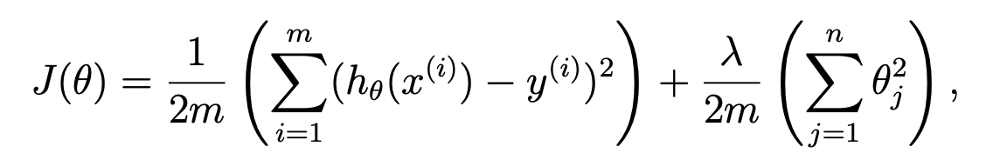
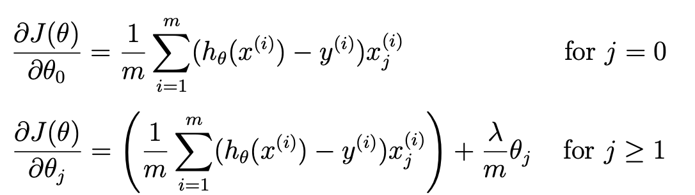
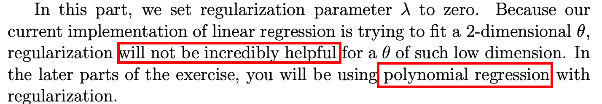
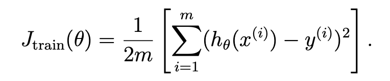
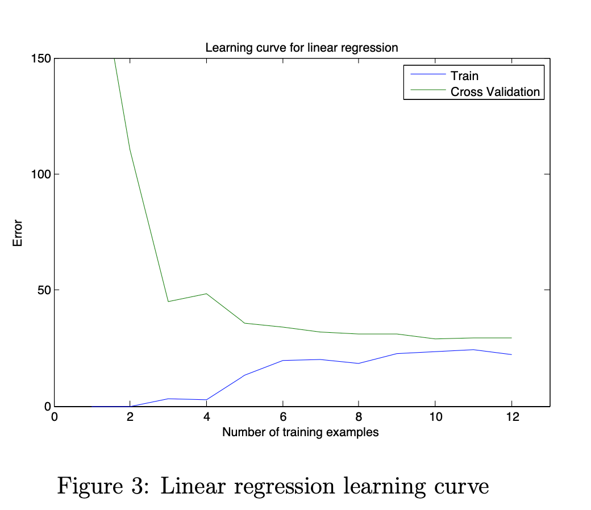
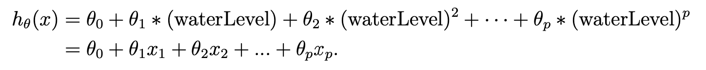

# ex5.m
## 第一步：Visualizing the dataset
1. training set （X, y）
2. cross validation set （Xval, yval）
3. test set （Xtest, ytest）


## 第二步：linearRegCostFunction.m 
## 第三步：trainLinearReg.m & fmincg.m
## 第四步：learningCurve.m
## 第五步：polyFeatures.m
## 第六步：featureNormalize.m

# linearRegCostFunction.m 




我的写法，不过grad一直无法通过。。。原来是只follow了题目中的情况。。维度可能>2
```matlab
J = sum((X * theta - y).^2) / (2*m) + lambda * sum(theta(2:end).^2) / (2*m);

grad(1) = sum((X * theta - y).* X(:,1)) / m;
grad(2) = sum((X * theta - y).* X(:,2)) / m + lambda * theta(2) / m;
```
想了半天也不太会用向量方式写，还是乖乖的写for循环吧。。
```matlab
J = sum((X * theta - y).^2) / (2*m) + lambda * sum(theta(2:end).^2) / (2*m);
grad(1) = sum((X * theta - y).* X(:,1)) / m;
for i = 2:size(grad, 1)
    grad(i) = sum((X * theta - y).* X(:,i)) / m + lambda * theta(i) / m;
end
```

# trainLinearReg.m & fmincg.m

这里不需要我实现：
```matlab
% Initialize Theta
initial_theta = zeros(size(X, 2), 1); 

% Create "short hand" for the cost function to be minimized
costFunction = @(t) linearRegCostFunction(X, y, t, lambda);

% Now, costFunction is a function that takes in only one argument
options = optimset('MaxIter', 200, 'GradObj', 'on');

% Minimize using fmincg
theta = fmincg(costFunction, initial_theta, options);
```

# learningCurve.m


刚开始有点茫然，不知道要干啥。。读了好几遍题目试了几次错才明白：每次训练的data个数不一样，逐步增加，看训练集和验证集的误差。训练集当然是根据当前data个数来，验证集完全都不是一个集合，全部都得上。
```matlab
for i = 1:m
    theta = trainLinearReg(X(1:i, :), y(1:i), lambda);
    error_train(i) = sum((X(1:i, :) * theta - y(1:i)).^2) / (2*i);
    error_val(i) = sum((Xval * theta - yval).^2) / (2*m);
end
```


看这个曲线图，应该能判断训练状况是high bias的。

# polyFeatures.m


很简单，不用多说，就是构造多维的features。
```matlab
for i = 1:p
    X_poly(:,i) = X.^i;
end
```
# featureNormalize.m
已提供的函数！这种正则化还蛮简单的！
```matlab
mu = mean(X);
X_norm = bsxfun(@minus, X, mu);

sigma = std(X_norm);
X_norm = bsxfun(@rdivide, X_norm, sigma);
```
# validationCurve.m
给定多个lambda，挑一个最好的：
```matlab
for i = 1:length(lambda_vec)
    theta = trainLinearReg(X, y, lambda_vec(i));
    error_train(i) = sum((X * theta - y).^2) / (2*size(X, 1));
    error_val(i) = sum((Xval * theta - yval).^2) / (2*size(Xval,1));
end
```

由结果可知，lamda=3最好


# plotFit.m
应该也是一个写好的工具类。


# matlab 学习
重温了end的知识！