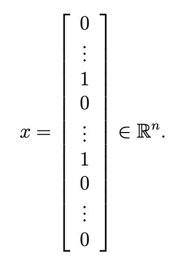

# ex6.m
## 第一步：plotData.m

## 第二步：gaussianKernel.m

## 第三步：dataset3Params.m

# plotData.m


# gaussianKernel.m


炒鸡简单！
```matlab
sim = exp(-sum((x1-x2).^2)/2/(sigma^2));
```

# dataset3Params.m
目的就是想得到最好的C和sigma，网格法计算
```matlab
choices = [0.01, 0.03, 0.1, 0.3, 1, 3, 10, 30];
prediction_error = zeros(size(choices, 2), size(choices, 2));

for i = 1:size(choices, 2)
    for j = 1:size(choices, 2)
        cur_C = choices(i);
        cur_sigma = choices(j);
        model = svmTrain(X, y, cur_C, @(x1, x2) gaussianKernel(x1, x2, cur_sigma));
        predictions = svmPredict(model, Xval);
        prediction_error(i, j) = mean(double(predictions ~= yval));
    end
end

min_value = min(prediction_error, [], 'all');

[C_index, sigma_index] = find(prediction_error == min_value);
C = choices(C_index);
sigma = choices(sigma_index);
```
- - - - - 
以下都是作业提供的工具类，就视觉效果来看写得应该都蛮好的。
# svmTrain.m


# svmPredict.m

# visualizeBoundaryLinear.m
这个是针对linear分割的
`wq*x+w2*y+b=0`

```matlab
w = model.w;
b = model.b;
xp = linspace(min(X(:,1)), max(X(:,1)), 100);
yp = - (w(1)*xp + b)/w(2);
plotData(X, y);
hold on;
plot(xp, yp, '-b'); 
hold off
```

# visualizeBoundary.m
这个是针对有kernel的分割的

根据我的debug，`meshgrid`这一步得到的[X1, X2]就像是一个铺满平面的点。`contour(X1, X2, vals, [0.5 0.5], 'b');`中的vals有0或1两种取值，分界线就是取值变化的地方。[0.5, 0.5]是一个向量。
```matlab
% Plot the training data on top of the boundary
plotData(X, y)

% Make classification predictions over a grid of values
x1plot = linspace(min(X(:,1)), max(X(:,1)), 100)';
x2plot = linspace(min(X(:,2)), max(X(:,2)), 100)';
[X1, X2] = meshgrid(x1plot, x2plot);
vals = zeros(size(X1));
for i = 1:size(X1, 2)
   this_X = [X1(:, i), X2(:, i)];
   vals(:, i) = svmPredict(model, this_X);
end

% Plot the SVM boundary
hold on
contour(X1, X2, vals, [0.5 0.5], 'b');
hold off;
```
效果：


# linearKernel.m
```matlab
% Compute the kernel
sim = x1' * x2;  % dot product
```


# ex6 spam.m
## 第一步：数据预处理
• Lower-casing: The entire email is converted into lower case, so that captialization is ignored (e.g., IndIcaTE is treated the same as Indicate).
• Stripping HTML: All HTML tags are removed from the emails. Many emails often come with HTML formatting; we remove all the HTML tags, so that only the content remains.
• Normalizing URLs: All URLs are replaced with the text “httpaddr”.
• Normalizing Email Addresses: All email addresses are replaced
with the text “emailaddr”.
• Normalizing Numbers: All numbers are replaced with the text
“number”.
• Normalizing Dollars: All dollar signs ($) are replaced with the text
“dollar”.
• Word Stemming: Words are reduced to their stemmed form. For ex- ample, “discount”, “discounts”, “discounted” and “discounting” are all replaced with “discount”. Sometimes, the Stemmer actually strips off additional characters from the end, so “include”, “includes”, “included”, and “including” are all replaced with “includ”.
• Removal of non-words: Non-words and punctuation have been re- moved. All white spaces (tabs, newlines, spaces) have all been trimmed to a single space character.

```matlab
% Lower case
email_contents = lower(email_contents);

% Strip all HTML
% Looks for any expression that starts with < and ends with > and replace
% and does not have any < or > in the tag it with a space
email_contents = regexprep(email_contents, '<[^<>]+>', ' ');

% Handle Numbers
% Look for one or more characters between 0-9
email_contents = regexprep(email_contents, '[0-9]+', 'number');

% Handle URLS
% Look for strings starting with http:// or https://
email_contents = regexprep(email_contents, ...
                           '(http|https)://[^\s]*', 'httpaddr');

% Handle Email Addresses
% Look for strings with @ in the middle
email_contents = regexprep(email_contents, '[^\s]+@[^\s]+', 'emailaddr');

% Handle $ sign
email_contents = regexprep(email_contents, '[$]+', 'dollar');
```

Our vocabulary list was selected by choosing all words which occur at least a 100 times in the spam corpus, resulting in a list of 1899 words. In practice, a vocabulary list with about 10,000 to 50,000 words is often used.

## 第二步：processEmail.m

## 第三步：emailFeatures.m

# getVocabList.m
已提供
```matlab
%% Read the fixed vocabulary list
fid = fopen('vocab.txt');

% Store all dictionary words in cell array vocab{}
n = 1899;  % Total number of words in the dictionary

% For ease of implementation, we use a struct to map the strings => integers
% In practice, you'll want to use some form of hashmap
vocabList = cell(n, 1);
for i = 1:n
    % Word Index (can ignore since it will be = i)
    fscanf(fid, '%d', 1);
    % Actual Word
    vocabList{i} = fscanf(fid, '%s', 1);
end
fclose(fid);
```


# processEmail.m
下面部分是我写的，需要添加的部分还蛮容易的；不过前面提供的处理却有点复杂。
```matlab
    for i = 1:size(vocabList,1)
        if (strcmp(vocabList{i}, str) == 1)
            word_indices(count) = i;
            count = count + 1;
            break
        end
    end
```
下面是提供的循环：
```matlab
% Process file
l = 0;
while ~isempty(email_contents)
    % Tokenize and also get rid of any punctuation
    [str, email_contents] = ...
       strtok(email_contents, ...
              [' @$/#.-:&*+=[]?!(){},''">_<;%' char(10) char(13)]);
   
    % Remove any non alphanumeric characters
    str = regexprep(str, '[^a-zA-Z0-9]', '');

    % Stem the word 
    % (the porterStemmer sometimes has issues, so we use a try catch block)
    try str = porterStemmer(strtrim(str)); 
    catch str = ''; continue;
    end;

    % Skip the word if it is too short
    if length(str) < 1
       continue;
    end
    XXXX我写的放在这里！！！！
    % Print to screen, ensuring that the output lines are not too long
    if (l + length(str) + 1) > 78
        fprintf('\n');
        l = 0;
    end
    fprintf('%s ', str);
    l = l + length(str) + 1;
end
```

# porterStemmer.m
Porter Stemming algorithm: 词干提取算法 （单复数、进行时加ing等变形处理）
过于复杂，没有心情看下去。。。

# emailFeatures.m


没有比这更简单的题了吧。。
```matlab
for i = 1:size(word_indices, 1)
    cur_num = word_indices(i);
    x(cur_num,:) = 1;
end
```
# readFile.m


# matlab 学习
## meshgrid
 meshgrid   Cartesian grid in 2-D/3-D space
    [X,Y] = meshgrid(xgv,ygv) replicates the grid vectors xgv and ygv to 
    produce the coordinates of a rectangular grid (X, Y). The grid vector
    xgv is replicated numel(ygv) times to form the columns of X. The grid 
    vector ygv is replicated numel(xgv) times to form the rows of Y.