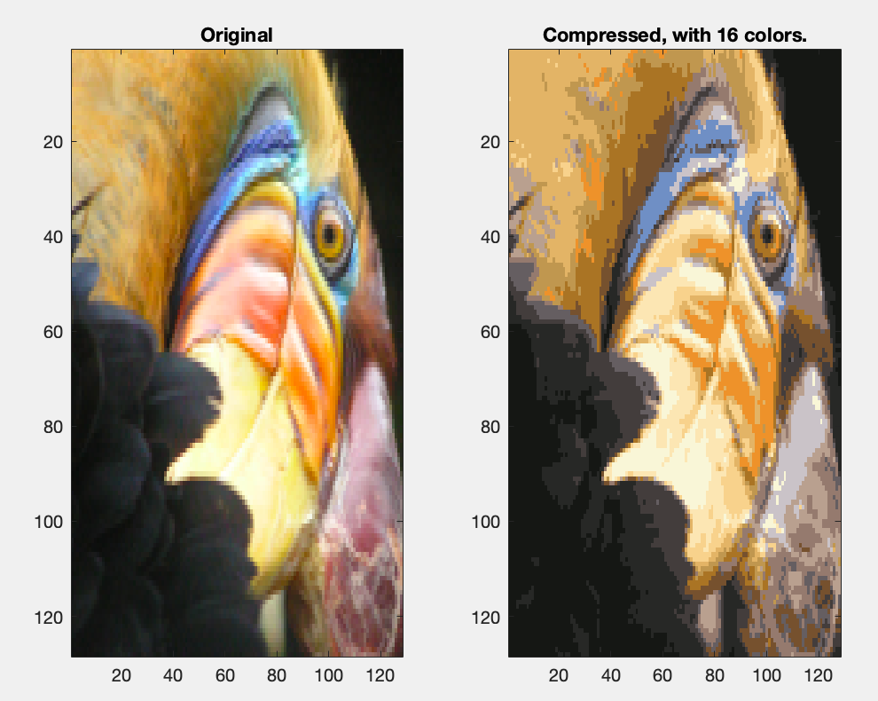
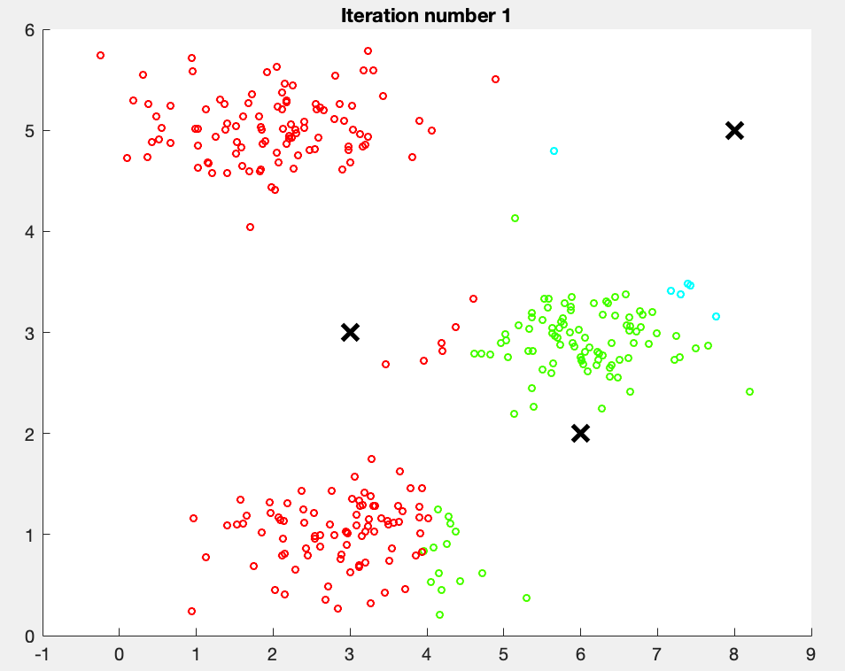
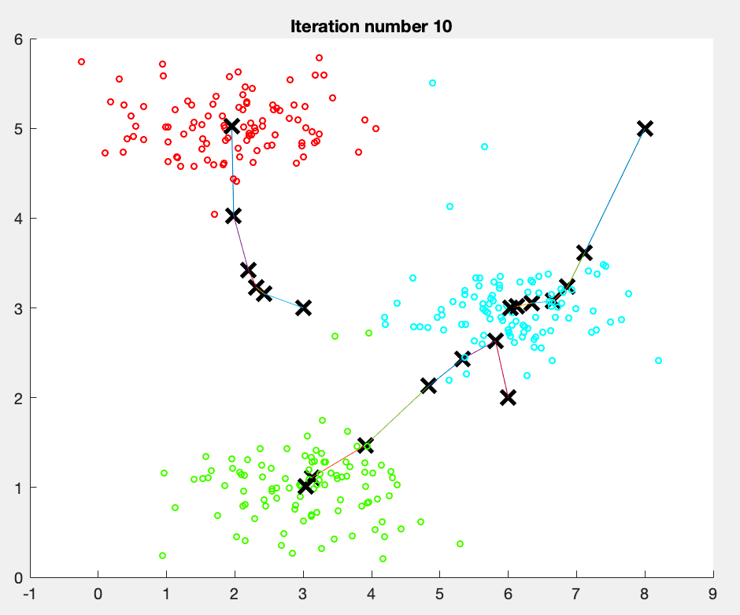
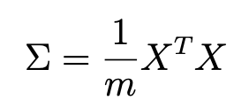
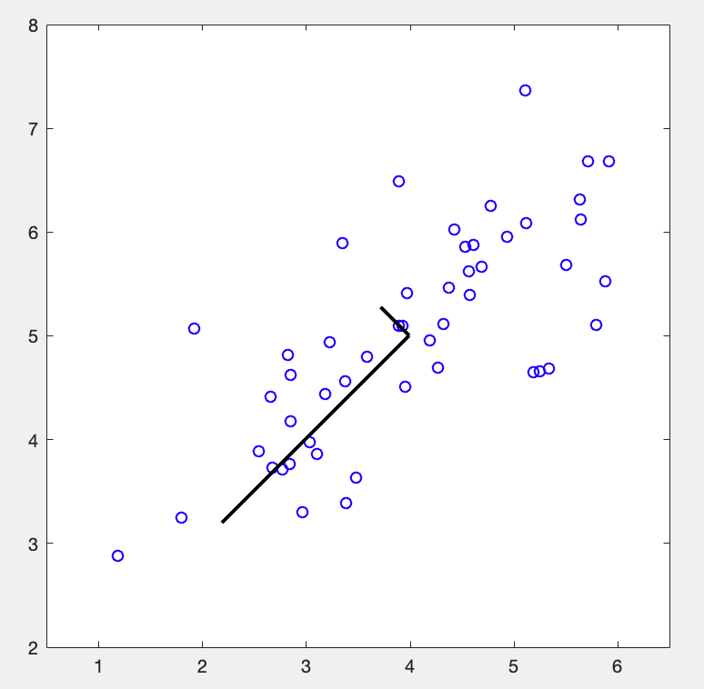
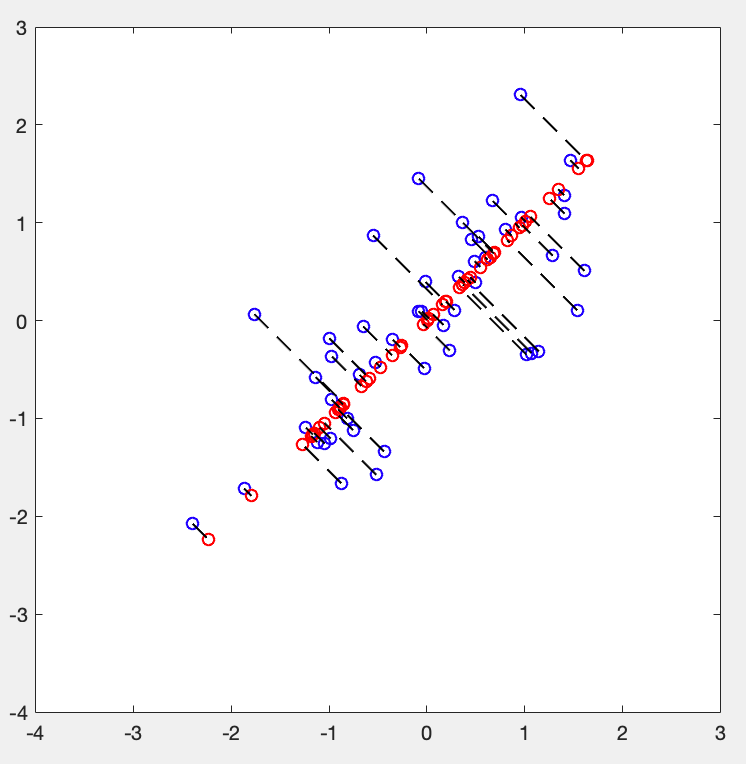

目标：使用 kmeans 来压缩照片。

# ex7.m

## 第一步：findClosestCentroids.m
## 第二步：computeCentroids.m
## 第三步：runkMeans.m
## 第四步：压缩图片
目标：256->16 colors
不需要写额外的代码，只需要把照片看作一个一个点的即可就可以了。


# findClosestCentroids.m
功能是给每一个点assign一个中心。很简单，需要注意两点
* X(i) 如果X是矩阵而不是向量，那么i只指代一个数字！如果想选择一行或者一列，需要两个索引共同控制！
* 求两个点之间距离，在标量维度很简单，就是平方一下；但是在矢量维度，还需要注意矩阵乘法的要求
```matlab
for i=1:size(X,1)
    min = (X(i,:) - centroids(1,:))*(X(i,:) - centroids(1,:))';
    idx(i) = 1;
    for j=2:size(centroids,1)
        dis = (X(i,:) - centroids(j,:))*(X(i,:) - centroids(j,:))';
        if (dis < min)
            min = dis;
            idx(i) = j;
        end
end
```
# computeCentroids.m
这个也算是比较简单吧，就是如果用矩阵运算来实现会更高效。不想思考的我还是用了for-loop...

```matlab
for i=1:K
   centroids(i,:) = sum(X(find(idx==i),:))/size(X(find(idx==i),:),1);
end
```

# runkMeans.m
不需要写代码，就看看k-means咋运行的。

...


# drawLine.m & plotDataPoints.m & plotProgresskMeans.m
上面的图就是通过这两个方法画出来的。

plotDataPoints.m 用到了 hsv 函数，挺巧妙的：
```matlab
% Create palette
palette = hsv(K + 1);
colors = palette(idx, :);

% Plot the data
scatter(X(:,1), X(:,2), 15, colors);
```

plotProgresskMeans.m 本质上每次迭代的中心点都被存下来了，每次都需要画这几个点+连线
```matlab
% Plot the examples
plotDataPoints(X, idx, K);

% Plot the centroids as black x's
plot(centroids(:,1), centroids(:,2), 'x', ...
     'MarkerEdgeColor','k', ...
     'MarkerSize', 10, 'LineWidth', 3);

% Plot the history of the centroids with lines
for j=1:size(centroids,1)
    drawLine(centroids(j, :), previous(j, :));
end

% Title
title(sprintf('Iteration number %d', i))
```

# kMeansInitCentroids.m
需要写的代码已经给定：
```matlab
% Initialize the centroids to be random examples
% Randomly reorder the indices of examples
randidx = randperm(size(X, 1));
% Take the first K examples as centroids
centroids = X(randidx(1:K), :);
```


# ex7 pca.m
目标：reduce data from 256 to 50 dimensions
PCA的用处：In practice, if you were using a learning algorithm such as linear regression or perhaps neural networks, you could now use the **projected data** instead of the original data. By using the projected data, you can train your model faster as there are less dimensions in the input.
## 第一步：featureNormalize.m
## 第二步：pca.m
## 第三步：projectData.m
## 第四步：

# featureNormalize.m
已经提供，数据的预处理过程，用于正则化数据的features。
```matlab
mu = mean(X);
X_norm = bsxfun(@minus, X, mu);

sigma = std(X_norm);
X_norm = bsxfun(@rdivide, X_norm, sigma);
```

# pca.m
首先计算 the covariance matrix of the data：

再使用SVD分解。

```matlab
sigma = X'*X./m
[U, S, V] = svd(sigma)
```
得到下面这个黑色的钩子：

这个钩子怎么画的？
```matlab
drawLine(mu, mu + 1.5 * S(1,1) * U(:,1)', '-k', 'LineWidth', 2);
drawLine(mu, mu + 1.5 * S(2,2) * U(:,2)', '-k', 'LineWidth', 2);
```
# projectData.m
好吧，真的好简单呀...看提示都能写出来了
```matlab
U_reduce = U(:, 1:K);
Z = X * U_reduce;
```

# recoverData.m
```matlab
X_rec = Z * U(:, 1:K)';
```

# displayData.m
不看了。
后面还有人脸的PCA以及三维映射到二维的例子，不过计算原理都一样。


# matlab 学习
## 读取一张图片
This creates a three-dimensional matrix A whose first two indices identify a pixel position and whose last index represents red, green, or blue. For example, A(50, 33, 3) gives the blue intensity of the pixel at row 50 and column 33.
```matlab
% Load 128x128 color image (bird small.png)
A = imread('bird small.png');
```
