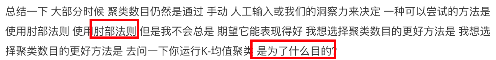
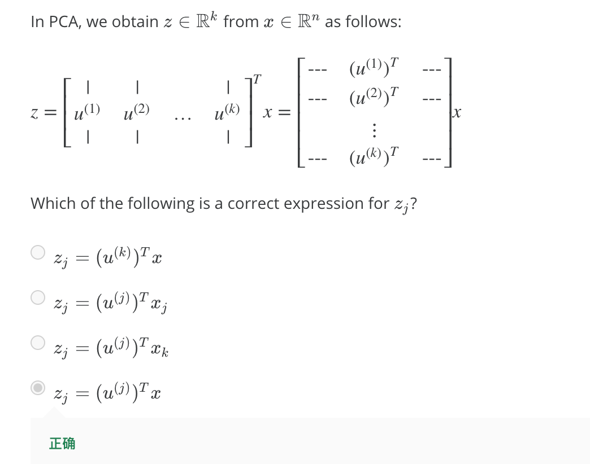

# Clustering

你也许会遇到某个中心点没有被分配任何sample，这可咋办？我们可以重新initialize一个中心点，不过最常见的做法是直接去掉这个中心点。（这种情况还是挺少发生的）

# Motivation
 dimensionality reduction - Data Compression

dimensionality reduction - Visualization
因为只能可视化k=2或3的情况，所以需要把维度降到2或3。

# Principal Component Analysis

左图是 linear regression，右图是 PCA

⬆️协方差均值 总满足一个数学性质 称为对称正定 (symmetric positive definite) 所以svd也可以用eig函数代替。

sigma：`n*n`

U矩阵: `n*n`

# Applying PCA

右边的算法虽然简单，但是没有证明，我有点无法被说服。

- - - - - -

好吧，B选项speed up也是OK的。。

同时我也建议 一开始不要将 PCA方法就直接放到算法里 先使用原始数据x(i)看看效果 只有一个原因 让我们相信算法出现了问题 那就是 你的学习算法 **收敛地非常缓慢** **占用内存** 或者**硬盘空间非常大** 所以你想来压缩数据 只有当你的x(i)效果不好 只有当你有证据或者 充足的理由来确定 x(i)效果不好的时候 那么就考虑用PCA来进行压缩数据。

