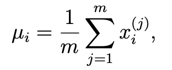
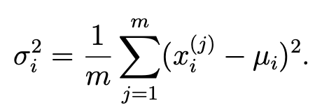
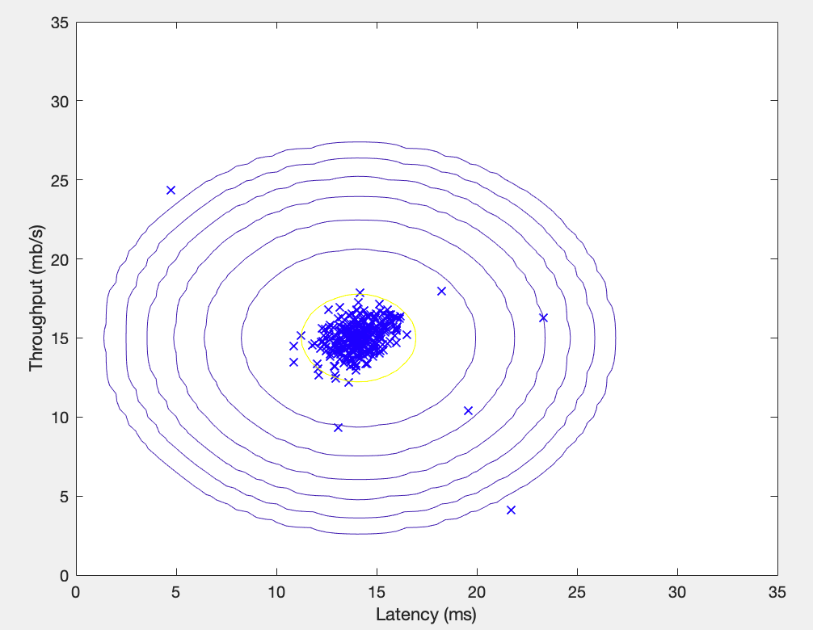
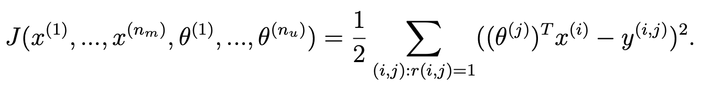
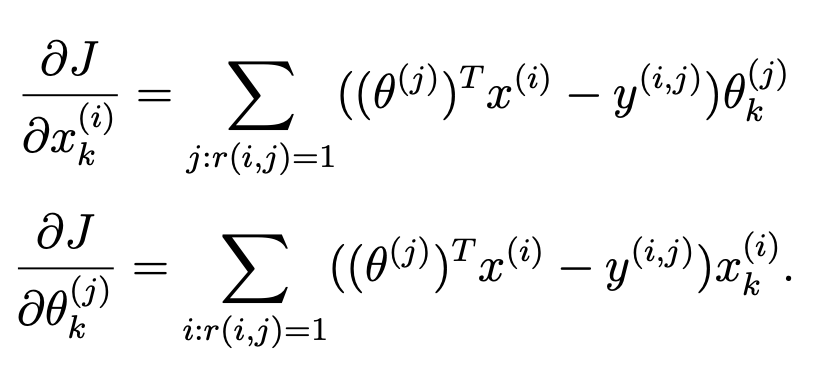
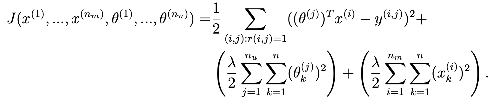
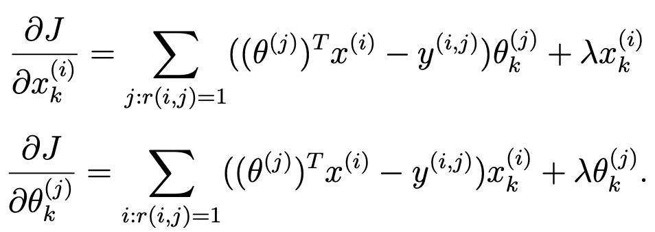

# ex8.m
anomaly detection algorithm
## 第一步：estimateGaussian.m
## 第二步：multivariateGaussian.m
## 第三步：visualizeFit.m
## 第四步：selectThreshold.m

# estimateGaussian.m



```matlab
mu = mean(X)';
sigma2 = var(X)'*(m-1)/m;
```
# visualizeFit.m

```matlab
[X1,X2] = meshgrid(0:.5:35); 
Z = multivariateGaussian([X1(:) X2(:)],mu,sigma2);
Z = reshape(Z,size(X1));

plot(X(:, 1), X(:, 2),'bx');
hold on;
% Do not plot if there are infinities
if (sum(isinf(Z)) == 0)
    contour(X1, X2, Z, 10.^(-20:3:0)');
end
hold off;
```
事实上，一步一步研究了代码我也不太理解这个图咋画出来的...

# multivariateGaussian.m
Returns the density of the multivariate normal at each data point (row) of X

```matlab
k = length(mu);

if (size(Sigma2, 2) == 1) || (size(Sigma2, 1) == 1)
    Sigma2 = diag(Sigma2);
end

X = bsxfun(@minus, X, mu(:)');
p = (2 * pi) ^ (- k / 2) * det(Sigma2) ^ (-0.5) * ...
    exp(-0.5 * sum(bsxfun(@times, X * pinv(Sigma2), X), 2));

end
```

# selectThreshold.m
easy!
```matlab
bestEpsilon = 0;
bestF1 = 0;
F1 = 0;

stepsize = (max(pval) - min(pval)) / 1000;
for epsilon = min(pval):stepsize:max(pval)
    predictions = (pval < epsilon);
    
    tp = yval'*predictions;
    fp = (~yval')*predictions;
    fn = yval'*(~predictions);
    
    prec = tp / (tp + fp);
    rec = tp / (tp + fn);

    F1 = 2 * prec * rec / (prec + rec);
    if F1 > bestF1
       bestF1 = F1;
       bestEpsilon = epsilon;
    end
end
```

# ex8 cofi.m
collaborative filtering

## 第一步：Loading movie ratings dataset
## 第二步：cofiCostFunc.m
## 第三步：loadMovieList.m
## 第四步：Entering ratings for a new user
## 第五步：Learning Movie Ratings （normalizeRatings.m）
## 第六步：Recommendation for you

# cofiCostFunc.m

```matlab
% Unfold the U and W matrices from params
X = reshape(params(1:num_movies*num_features), num_movies, num_features);
Theta = reshape(params(num_movies*num_features+1:end), ...
                num_users, num_features);
% You need to return the following values correctly
J = 0;
X_grad = zeros(size(X));
Theta_grad = zeros(size(Theta));
for i=1:num_movies
    for j=1:num_users
        if R(i,j) == 1
            J = J + (Theta(j,:)*X(i,:)' - Y(i,j))^2/2;
        end
    end
end
grad = [X_grad(:); Theta_grad(:)];
```
但是guide说这个函数调用比较频繁，还是用vectorized方法提高效率。

```matlab
diff = X*Theta'-Y;
J = sum(diff.^2.*R, "all")/2;
```
- - - - - 
接着就是计算gradient了：


```matlab
diff = X*Theta'-Y;
J = sum(diff.^2.*R, "all")/2;

X_grad = diff.*R*Theta;
Theta_grad = (diff.*R)'*X;
```
- - - - - 
最后不要忘记加上正则化哦！




```matlab
J = J + (lambda*sum(Theta.*Theta, "all")/2) + (lambda*sum(X.*X, "all")/2); 

X_grad = diff.*R*Theta + lambda*X;

Theta_grad = (diff.*R)'*X + lambda*Theta;
```


# checkCostFunction.m
通过 `computeNumericalGradient.m` 来检查gradient计算是否正确。

# computeNumericalGradient.m
Computes the gradient using "finite differences" and gives us a numerical estimate of the gradient.

```matlab
numgrad = zeros(size(theta));
perturb = zeros(size(theta));
e = 1e-4;
for p = 1:numel(theta)
    % Set perturbation vector
    perturb(p) = e;
    loss1 = J(theta - perturb);
    loss2 = J(theta + perturb);
    % Compute Numerical Gradient
    numgrad(p) = (loss2 - loss1) / (2*e);
    perturb(p) = 0;
end
```

# loadMovieList.m
顾名思义

# normalizeRatings.m
Preprocess data by subtracting mean rating for every movie (every row)


